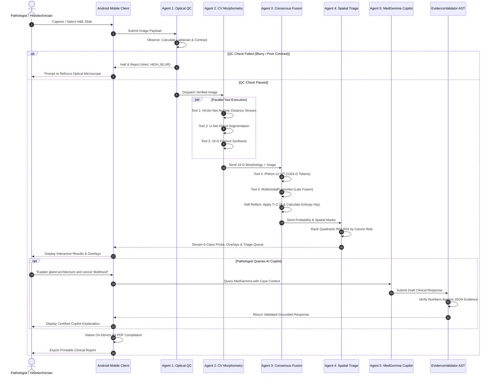

# AGENTIC AI ARCHITECTURE & WORKFLOW
## COLONPATH-AI V3: Hierarchical Multi-Agent Clinical Decision-Support System for Colorectal Histopathology

**Document Version:** 5.5  
**Date:** September 2026  
**Audience:** Jury Panels, AI Evaluators, Clinical Informatics Specialists, Technical Leads  

---

## 1. Executive Answer: Is ColonPath-AI an Agentic AI System?

### **YES, ABSOLUTELY.**
ColonPath-AI is designed as a **Hierarchical Multi-Agent Clinical Decision-Support System**. 

Unlike a traditional, static machine learning pipeline (which blindly passes an image through a single black-box CNN to produce a static label), ColonPath-AI operates as an **autonomous multi-agent system** that:
1. **Perceives** multi-modal inputs (optical video frames, cell instances, gland architecture, foundation tokens).
2. **Dynamically Invokes Specialized Tools** (Laplacian QC, HoVer-Net distance tensors, U-Net gland segmenter, Phikon-v2 ViT, morphological geometry calculators).
3. **Reasons & Verifies (Consensus & Reflection)**: Cross-examines visual deep features against physical cell measurements and computes Shannon entropy to autonomously decide whether to confirm diagnosis or abstain.
4. **Acts & Triages**: Dynamically ranks suspicious 2x2 quadrants, generates vector A4 reports, and answers clinical queries through a grounded medical language agent guarded by deterministic AST validation.
5. **Human-in-the-Loop Supervisory Integration**: Collaborates interactively with the pathologist, routing high-uncertainty edge cases for expert review.

---

## 2. Static Pipeline vs. ColonPath-AI Agentic System

| Dimension | Traditional Deep Learning Pipeline | ColonPath-AI Multi-Agent System |
| :--- | :--- | :--- |
| **Control Flow** | Rigid, single-pass feedforward execution ($X \to Y$). | **Dynamic, goal-driven multi-agent orchestration with conditional branching and quality gates.** |
| **Tool Use & Modularity** | Monolithic model (e.g. standard ResNet/DenseNet). | **Multi-Tool Orchestration:** Dispatches specialized sub-agents for quality control, cell segmentation, gland geometry, and foundation embeddings. |
| **Self-Reflection & Calibration** | Outputs uncalibrated, overconfident probabilities (e.g. 99.9% on wrong calls). | **Epistemic Reflection:** Calculates normalized Shannon entropy ($H(p)$) and temperature calibration ($T=2.20$) to self-evaluate uncertainty. |
| **Consensus & Verification** | No verification; single model output accepted as truth. | **Consensus Concordance Engine:** Cross-verifies visual ViT features against physical nuclear pleomorphism metrics. |
| **Language & Interactivity** | None or post-hoc static text template. | **Conversational Clinical Copilot (MedGemma 1.5 4B IT)** with deterministic `EvidenceValidator` anti-hallucination AST gatekeeper. |
| **Action & Workflow** | Generates a single classification score. | **Autonomously builds 2x2 priority triage queues, generates 7 visual overlays, and compiles native A4 PDF reports.** |

---

## 3. The 5 Autonomous Specialized Agents

```
┌──────────────────────────────────────────────────────────────────────────────────┐
│                         COLONPATH-AI MULTI-AGENT SYSTEM                          │
└────────────────────────────────────────┬─────────────────────────────────────────┘
                                         │
                 ┌───────────────────────┴───────────────────────┐
                 ▼                                               ▼
     ┌───────────────────────────┐                   ┌───────────────────────────┐
     │ AGENT 1: PERCEPTION GATE  │                   │  AGENT 2: CV MORPHOMETRY  │
     │     (OpticalQCAgent)      │                   │  (MorphologyVisionAgent)  │
     │ • Blur / Focus Check      │                   │ • HoVer-Net Cell Analysis │
     │ • Brightness / Contrast   │                   │ • U-Net Gland Boundary    │
     │ • Rejection Gatekeeper    │                   │ • 16-D Feature Vector     │
     └─────────────┬─────────────┘                   └─────────────┬─────────────┘
                   │ Passed                                        │
                   └───────────────────────┬───────────────────────┘
                                           ▼
                             ┌───────────────────────────┐
                             │ AGENT 3: CONSENSUS FUSION │
                             │  (ConsensusFusionAgent)   │
                             │ • Phikon-v2 ViT Embedding │
                             │ • MultimodalFusionNet     │
                             │ • Temperature Scaling     │
                             │ • Shannon Uncertainty Gate│
                             └─────────────┬─────────────┘
                                           │
                 ┌─────────────────────────┴─────────────────────────┐
                 ▼                                                   ▼
     ┌───────────────────────────┐                       ┌───────────────────────────┐
     │  AGENT 4: SPATIAL TRIAGE  │                       │ AGENT 5: CLINICAL COPILOT │
     │   (SpatialTriageAgent)    │                       │ (PathologistCopilotAgent) │
     │ • 2x2 Focus Grid (R01-R04)│                       │ • MedGemma 1.5 4B IT LLM  │
     │ • Crowding Prioritization │                       │ • EvidenceValidator AST   │
     │ • Triage Queue Execution  │                       │ • Factual Grounding       │
     └───────────────────────────┘                       └───────────────────────────┘
```

### 🤖 Agent 1: Optical Quality & Perception Gatekeeper (`OpticalQCAgent`)
- **Role:** Autonomous slide quality inspector.
- **Tools Used:** Laplacian Variance Filter ($\sigma^2 \ge 50$), Brightness Histogram ($40 \le \mu \le 220$), Contrast Evaluator ($\sigma \ge 25$).
- **Agentic Decision:** If the slide is out-of-focus, stained improperly, or degraded, the agent **aborts pipeline execution**, issues a descriptive alert (`HIGH_BLUR` / `LOW_CONTRAST`), and prompts the user for slide readjustment before wasting compute.

### 🤖 Agent 2: Computer Vision & Histomorphometry Agent (`MorphologyVisionAgent`)
- **Role:** High-precision cell and glandular feature extraction.
- **Tools Used:** HoVer-Net ResNet-50 instance segmentation, U-Net gland boundary detector, OpenCV 8-connectivity contour analyzer, Ellipse fitting engine.
- **Agentic Decision:** Slices large tiles into overlapping patches, computes horizontal/vertical distance gradients, reconstructs seamless coordinate maps, and synthesizes the exact **16-D Histomorphometry Feature Vector**.

### 🤖 Agent 3: Multimodal Fusion & Consensus Reasoning Agent (`ConsensusFusionAgent`)
- **Role:** Cognitive diagnosis, cross-model verification, and uncertainty estimation.
- **Tools Used:** Phikon-v2 ViT-L/16 (DINOv2), `MultimodalFusionNet` Late-Fusion Bottleneck, Temperature Calibrator ($T=2.20$), Shannon Entropy Calculator ($H(p)$).
- **Agentic Decision:**
  - Integrates 1024D visual tokens with 16D cell morphology into calibrated 6-class probabilities.
  - **Self-Reflection:** If normalized entropy $H(p) \ge 0.45$, marks the case as `HIGH_UNCERTAINTY` and routes it for mandatory expert sign-off.
  - **Consensus Checking:** Validates visual ViT predictions against physical nuclear counts (HIGH vs LOW concordance).

### 🤖 Agent 4: Spatial Triage & Risk Prioritization Agent (`SpatialTriageAgent`)
- **Role:** Spatial navigation assistant for busy pathologists.
- **Tools Used:** Quadrant decomposition grid, nuclear crowding index aggregator, malignant density score calculator.
- **Agentic Decision:** Subdivides the specimen into 4 spatial quadrants ($R_{01}, R_{02}, R_{03}, R_{04}$) and orders them by highest malignant probability and nuclear density, directing the pathologist to inspect the highest-risk area first.

### 🤖 Agent 5: Grounded Clinical Language & Anti-Hallucination Agent (`PathologistCopilotAgent`)
- **Role:** Interactive clinical consultant and explainer.
- **Tools Used:** Google MedGemma 1.5 4B IT Vision-Language Model, Deterministic `EvidenceValidator` AST & Regex parser.
- **Agentic Decision:**
  - Answers pathologist inquiries regarding cell populations, gland architectural disruption, and diagnostic significance.
  - **Anti-Hallucination Guardrail:** The agent scans its generated text against the computed JSON evidence tensor. Any numerical deviation $>5\%$ is rejected and corrected before presentation to the clinician.

---

## 4. End-to-End Agentic Workflow (The OODA Loop)

The system continuously executes an **Observe $\to$ Orient $\to$ Decide $\to$ Act** clinical loop:



---

## 5. How to Defend the "Agentic AI" Question to the Jury

When a jury evaluator asks: **"Is your project Agentic AI or just a set of scripts?"**, use this structured team response:

#### Akshya (AI Lead):
> *"Yes, ColonPath-AI is fundamentally an Agentic AI architecture. It does not execute a static feedforward script; it is governed by an autonomous multi-agent orchestration loop. It incorporates five specialized agents: an Optical Quality Gatekeeper Agent that decides whether input data is diagnostically valid, a Computer Vision Perception Agent that extracts 16-D cell geometry, a Cognitive Consensus Agent that cross-examines visual embeddings against physical cell counts, a Spatial Triage Agent that prioritizes slide regions, and a Conversational Clinical Copilot powered by MedGemma that reasons with deterministic anti-hallucination guardrails."*

#### Amirtha (CV Lead):
> *"Crucially, our system exhibits the core hallmarks of agentic workflows: dynamic tool-use, autonomous self-reflection (via temperature calibration and Shannon entropy uncertainty thresholding), and closed-loop verification. If a slide is out-of-distribution or ambiguous, the agent autonomously halts or abstains, flagging the exact reason for human expert review."*

#### Adithya (Android Lead):
> *"On the client side, our Android application acts as the agent's interactive interface—pre-fetching multi-layer overlays, maintaining isolated session contexts, and executing native vector report generation at the point of examination."*

---
