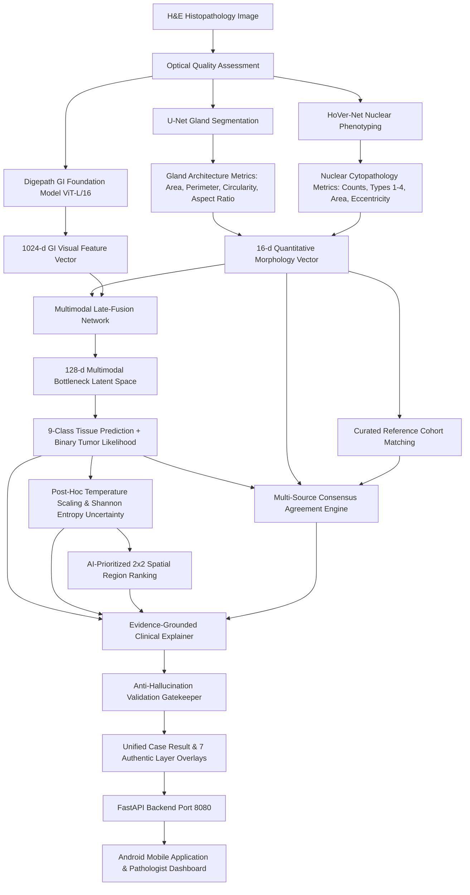

# COLONPATH-AI V3: Multimodal Clinical Decision Support System

[](https://www.python.org/)
[](https://pytorch.org/)
[](https://fastapi.tiangolo.com/)
[](https://developer.android.com/jetpack/compose)
[](https://opensource.org/licenses/MIT)

**COLONPATH-AI V3** is an end-to-end multimodal AI-assisted decision-support ecosystem designed for colorectal histopathology. The system combines deep gastrointestinal foundation vision models (Phikon-v2 DINOv2 ViT-L/16) with cellular/glandular morphological phenotyping (U-Net + HoVer-Net), post-hoc confidence calibration, Shannon entropy uncertainty estimation, AI-prioritized spatial region triage, and strict anti-hallucination guardrails, seamlessly delivered to pathologists via a modern Android application and interactive web dashboard.

---

## 🧭 Repository Structure

```
ColonPathAIV3/
├── 📱 android/              # Native Android Application (Kotlin, Jetpack Compose, Material 3)
│   ├── app/src/main/        # 10 UI Screens, Custom Pathology Theme, PDF Report Generator
│   ├── build.gradle.kts     # Build configuration and dependencies
│   └── AndroidManifest.xml  # Permissions, activities, and hardware features
│
├── 🧠 backend/              # FastAPI REST Backend & Intelligence Pipelines (colonpath_ai)
│   ├── api/                 # REST Routes (/health, /analyze, /cases, /regions, /review, /copilot)
│   ├── foundation/          # Phikon-v2 ViT-L/16 GI Foundation Model extractor & cache
│   ├── fusion/              # Multimodal Late-Fusion Network (1024-d visual + 16-d morphology)
│   ├── classifiers/         # 9-class tissue classifier (NCT-CRC-HE-100K) & binary tumor head
│   ├── uncertainty/         # Post-hoc temperature scaling & Shannon entropy engine
│   ├── agreement/           # Multi-source cross-evidence consensus engine
│   ├── regions/             # AI-prioritized 2x2 spatial patch ranking & navigation
│   ├── agent/               # Evidence validator & anti-hallucination gatekeeper
│   ├── visualization/       # 7 authentic histopathology layer overlay renderers
│   ├── storage/             # SQLite database manager & case repository
│   ├── web/                 # Interactive HTML5/JS histopathology layer viewer
│   └── main.py              # Unified CLI and server runner
│
├── 🔬 cv/                   # Computer Vision, Segmentation & Morphology Pipelines
│   ├── models/              # U-Net gland segmentation & HoVer-Net architectures
│   ├── morphology/          # Per-cell & per-gland quantitative measurement extractors
│   ├── preprocessing/       # Quality checks (Laplacian blur, brightness, contrast, HSV)
│   └── datasets/            # GlaS & CoNIC dataset processing scripts
│
├── 📁 source_material/      # Reference slides, benchmark images, and clinical guides
└── 📄 README.md             # Project master documentation
```

---

## 🔬 End-to-End Multimodal Pipeline



---

## 🚀 Quickstart & Setup

### 1. Backend Server Setup

```bash
cd backend
pip install -r colonpath_ai/requirements-working.txt
pip install fastapi uvicorn timm pydantic
```

Start the live backend server:
```bash
python main.py --server --port 8080
```

Access in your browser:
- **Interactive Web Dashboard:** `http://127.0.0.1:8080/`
- **Interactive Swagger Docs:** `http://127.0.0.1:8080/docs`
- **ReDoc Specification:** `http://127.0.0.1:8080/redoc`

---

### 2. Running Analysis via CLI

Analyze an H&E patch directly from the command line:
```bash
python main.py --image colonpath_ai/outputs/hovernet_test/input/00000.png --case_id CASE_DEMO_001
```

---

### 3. Android Application

1. Open the `android/` directory in **Android Studio Ladybug (or newer)**.
2. Ensure Android SDK 34+ is installed.
3. For Android Emulator, the app connects to the local backend at `http://10.0.2.2:8080`.
4. For physical devices on the same Wi-Fi network, point to `http://<YOUR_HOST_IP>:8080`.
5. Build and run on your device or emulator.

---

## 📡 REST API Contract Summary

| Endpoint | Method | Description |
| :--- | :--- | :--- |
| `/health` | `GET` | System health check and GPU hardware state |
| `/analyze` | `POST` | Multipart image upload for full multimodal evaluation |
| `/cases` | `GET` | List all historical cases from SQLite storage |
| `/cases/{id}/result` | `GET` | Retrieve structured `case_result.json` |
| `/cases/{id}/image` | `GET` | Stream original high-resolution H&E image |
| `/cases/{id}/visualization/{type}` | `GET` | Stream rendered layer overlays (`original`, `glands`, `nuclei`, `regions`, `uncertainty`, `top_regions`, `pseudo_3d`) |
| `/cases/{id}/regions` | `GET` | List all AI-prioritized spatial regions with bounding boxes |
| `/cases/{id}/regions/next` | `GET` | Sequential triage navigator for pathologist inspection |
| `/cases/{id}/review` | `POST` | Submit pathologist-in-the-loop review actions |
| `/cases/{id}/notes` | `POST` | Add case clinical annotations |
| `/copilot/ask` | `POST` | Evidence-grounded clinical Q&A copilot |

---

## 🛡️ Medical Safety & Anti-Hallucination Guardrails

- **Decision-Support Phrasing:** The system strictly uses decision-support phrasing (`AI-Prioritized Region`, `MARK REVIEWED`, `Calibrated Probability`) and prohibits autonomous diagnostic overclaims (`confirmed cancer`, `100% accurate`).
- **Verifiable Grounding:** All AI explanations are checked by `EvidenceValidator` against deterministic CV measurements before presentation to clinicians.
- **Automated Abstention:** Elevated Shannon entropy ($H(p) \ge 0.50$) or compromised image quality automatically flags mandatory pathologist review.

---

## 👥 Authors & Team

- **Adithya PK** — Android Application & System Architecture
- **Akshya** — Multimodal Backend, Late-Fusion Classifier, Uncertainty & API
- **Amirtha** — Computer Vision, Gland/Nuclear Segmentation & Morphology Extractors
