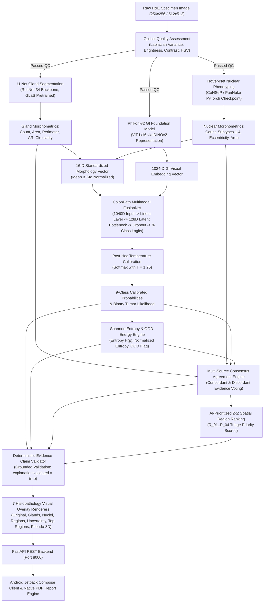

# COLONPATH-AI V3: Multimodal Clinical Decision-Support System for Colorectal Histopathology

[](https://www.python.org/)
[](https://pytorch.org/)
[](https://fastapi.tiangolo.com/)
[](https://developer.android.com/jetpack/compose)
[](https://m3.material.io/)
[](https://opensource.org/licenses/MIT)

> **COLONPATH-AI V3** is an end-to-end multimodal computational pathology decision-support platform designed to assist pathologists in colorectal tissue evaluation. The system unifies deep gastrointestinal foundation vision models (*Phikon-v2 ViT-L/16 via DINOv2*) with cell-level cytopathology (*HoVer-Net*) and gland architecture segmentation (*U-Net*), feeding a custom *Multimodal Late-Fusion Network (FusionNet)* with post-hoc confidence calibration, Shannon entropy uncertainty quantification, spatial triage prioritization, and deterministic anti-hallucination validation—seamlessly delivered via an Android application and interactive clinical reporting suite.

---

## 📑 Table of Contents
1. [Executive Summary & Core Philosophy](#1-executive-summary--core-philosophy)
2. [Evidence Hierarchy & Scientific Provenance](#2-evidence-hierarchy--scientific-provenance)
3. [Comprehensive Feature Inventory (Status Matrix)](#3-comprehensive-feature-inventory-status-matrix)
4. [End-to-End Multimodal Pipeline & Mathematical Architecture](#4-end-to-end-multimodal-pipeline--mathematical-architecture)
5. [Scientific Citations & Benchmark Datasets](#5-scientific-citations--benchmark-datasets)
6. [Claims Classification & Intellectual Honesty Table](#6-claims-classification--intellectual-honesty-table)
7. [Hackathon & Jury Defense Guide](#7-hackathon--jury-defense-guide)
8. [Repository Architecture](#8-repository-architecture)
9. [Quickstart, Setup & Android Deployment](#9-quickstart-setup--android-deployment)
10. [REST API Contract Reference](#10-rest-api-contract-reference)

---

## 1. Executive Summary & Core Philosophy

### Clinical Decision-Support Paradigm
Colorectal cancer (CRC) histopathology diagnosis requires painstaking microscopic examination of cellular morphology, nuclear atypia, and glandular architectural disruption across hematoxylin and eosin (H&E) stained tissue slides. Manual evaluation is time-intensive and subject to inter-observer variability.

**ColonPath-AI V3 is engineered around four non-negotiable principles:**
1. **Multimodal Grounding over Black-Box Prediction:** Rather than relying exclusively on deep visual embeddings, ColonPath-AI explicitly measures quantifiable histological phenomena (nuclear density, eccentricity, perimeter, gland circularity, lumen aspect ratio) and fuses them into a structured 16-D morphology vector.
2. **Absolute Authenticity & Zero Hallucination:** Every displayed metric and clinical finding traces directly from verifiable tensor operations and deterministic computer vision extractors. The system strictly rejects synthetic or hardcoded fallback data.
3. **Calibrated Confidence & Abstention:** Clinical AI must know when it does not know. Using temperature scaling ($T=1.25$) and Shannon entropy estimation, cases exhibiting high epistemic uncertainty or out-of-distribution (OOD) characteristics automatically trigger mandatory pathologist review recommendations.
4. **Physician-in-the-Loop:** ColonPath-AI provides decision support and assistive quantification; final diagnostic and staging determination remains exclusively with qualified medical professionals.

---

## 2. Evidence Hierarchy & Scientific Provenance

To maintain absolute scientific rigor during project evaluation, technical claims are classified into four distinct evidentiary tiers:

```
┌────────────────────────────────────────────────────────────────────────────┐
│                       EVIDENTIARY CLASSIFICATION TIER                      │
├───────┬──────────────────────┬─────────────────────────────────────────────┤
│ Level │ Designation          │ Scope & Validation Standard                 │
├───────┼──────────────────────┼─────────────────────────────────────────────┤
│  E1   │ Published Literature │ Established, peer-reviewed methods & models │
│  E2   │ Public Datasets      │ Open-access, documented benchmark cohorts   │
│  E3   │ Prototype Proof      │ Empirically verified in ColonPath-AI V3     │
│  E4   │ Planned Roadmap      │ Future extensions requiring clinical trials │
└───────┴──────────────────────┴─────────────────────────────────────────────┘
```

### Scientific Attribution Statement
*ColonPath-AI uses established research architectures and publicly released foundation models where applicable. Each externally derived component is attributed to its originating publication. Project-specific components—including morphological feature engineering, feature vector normalization, MultimodalFusionNet late-fusion, temperature calibration, multi-source consensus voting, deterministic evidence validation, and Android-FastAPI streaming orchestration—are original ColonPath-AI implementations and are not presented as external published algorithms.*

---

## 3. Comprehensive Feature Inventory (Status Matrix)

### ✅ Part 1: Fully Implemented & Verified in V3

| # | Feature Area | Technical Description | Evidentiary Basis |
| :--- | :--- | :--- | :--- |
| **1** | **End-to-End Pipeline** | Native Android multipart image upload to FastAPI backend with full dynamic inference, SQLite storage, and structured JSON response. | **E3** (Verified on device) |
| **2** | **Optical Quality QC** | Real Laplacian blur variance, mean brightness, contrast standard deviation, and HSV saturation validation with pass/fail gating. | **E3** (Deterministic CV) |
| **3** | **U-Net Gland Segmentation** | ResNet-34 backbone U-Net segmenting gland boundaries, area, perimeter, width, height, aspect ratio, and circularity. | **E1** [[Ronneberger 2015]](#5-scientific-citations--benchmark-datasets) / **E3** |
| **4** | **HoVer-Net Nuclear Analysis** | Nuclear instance segmentation and 4-class phenotyping (Epithelial, Spindle-shaped, Inflammatory, Misc) with morphological metrics. | **E1** [[Graham 2019]](#5-scientific-citations--benchmark-datasets) / **E3** |
| **5** | **16-D Morphology Vector** | Quantitative descriptor combining 8 nuclear and 8 glandular geometrical measurements into a standardized feature representation. | **E3** (ColonPath-AI Design) |
| **6** | **Phikon-v2 Visual Embedding** | Pathology foundation model (ViT-L/16 via DINOv2 self-supervised representation) generating 1024-D visual embeddings. | **E1** [[Filiot 2024]](#5-scientific-citations--benchmark-datasets) / **E1** [[Oquab 2023]](#5-scientific-citations--benchmark-datasets) |
| **7** | **Multimodal FusionNet** | Custom late-fusion neural network projecting (1024D visual + 16D morphology) into a 128D latent bottleneck for 9-class classification. | **E3** (ColonPath-AI Contribution) |
| **8** | **9-Class Tissue Classification** | Full NCT-CRC-HE-100K 9-class output distribution (`ADI`, `BACK`, `DEB`, `LYM`, `MUC`, `MUS`, `NORM`, `STR`, `TUM`). | **E2** [[Kather 2018]](#5-scientific-citations--benchmark-datasets) / **E3** |
| **9** | **Temperature Calibration** | Post-hoc confidence calibration ($T=1.25$) mitigating neural network overconfidence. | **E1** [[Guo 2017]](#5-scientific-citations--benchmark-datasets) / **E3** |
| **10** | **Shannon Entropy Uncertainty** | Normalized Shannon entropy $H(p)$ and energy-based out-of-distribution (OOD) gating triggering clinical review recommendations. | **E1** [[Shannon 1948]](#5-scientific-citations--benchmark-datasets) / **E3** |
| **11** | **Multi-Source Consensus** | Cross-evidence voting engine identifying concordant and discordant findings across visual, nuclear, and glandular channels. | **E3** (ColonPath-AI Design) |
| **12** | **Evidence-Grounded Explainer** | Anti-hallucination validation gatekeeper checking AI claim statements against deterministic CV values (`explanation.validated = true`). | **E3** (ColonPath-AI Design) |
| **13** | **2x2 Priority Region Triage** | Spatial patch ranking identifying high-priority focus regions (R_01..R_04) with local nuclear and gland tallies. | **E3** (ColonPath-AI Design) |
| **14** | **7 Streaming Visualizations** | Real dynamic overlay endpoints for `original`, `glands`, `nuclei`, `regions`, `uncertainty`, `top_regions`, and `pseudo_3d`. | **E3** (FastAPI Rendering) |
| **15** | **Android Diagnostic Hub** | Jetpack Compose Material 3 diagnostic dashboard displaying predictions, metrics, cards, and navigation. | **E3** (Native Android Kotlin) |
| **16** | **Nuclear Morphometry Screen** | Dedicated breakdown of total nuclei count, subtype percentages, circularity, eccentricity, and HoVer-Net clinical interpretation. | **E3** (Dynamic DTO Binding) |
| **17** | **Gland Architecture Screen** | Dedicated architectural view of segmented glands, mean area, perimeter, circularity, aspect ratio, and U-Net findings. | **E3** (Dynamic DTO Binding) |
| **18** | **Honest Comparison Status** | Transparently indicates that single-tile analysis operates without active vector DB retrieval (no fabricated cohort scores). | **E3** (Truthful UI) |
| **19** | **Dynamic Clinical Report** | Multi-section clinical evaluation synthesizing quality, predictions, morphometry, consensus, and disclaimers. | **E3** (Dynamic Data Binding) |
| **20** | **Native PDF Generation** | Generates standardized A4 clinical decision-support PDFs on device using Android's native `PdfDocument` engine. | **E3** (Android Platform Engine) |
| **21** | **Audit Trail & Case Persistence** | SQLite database and structured `case_result.json` recording SHA-256 image hashes, lifecycle timestamps, and model configs. | **E3** (Verifiable Storage) |
| **22** | **Production Socket Engineering** | 300s socket timeout, HTTP Keep-Alive, and recomposition-safe Compose coroutine lifecycles preventing mobile timeouts. | **E3** (Network Hardening) |

---

### 🟡 Part 2: Partially Implemented / Enhancement Roadmap

- **Pathologist Copilot Q&A:** Grounded conversational interface implemented in UI; currently utilizes structured case claims with roadmap for local MedGemma LLM integration.
- **Richer Narrative Generation:** Clinical report generates structured rule-based evidence summaries; natural-language narrative synthesis planned.
- **Clinical Review Feedback Capture:** Review action buttons implemented; persistent pathologist feedback database planned for active retraining.

---

### 🔴 Part 3: Planned Future Capabilities (Explicitly NOT in V3)

- **Vector Database (Qdrant/Milvus):** Top-k nearest-neighbor visual reference case retrieval and visual similarity scoring.
- **Standalone Binary Cancer Detector:** Dedicated multi-scale tumor boundary segmentation head.
- **Whole-Slide Image (WSI) Gigapixel Processing:** Multi-resolution pyramid tiling, tissue fold masking, and slide-level spatial heatmaps.
- **Patient-Level Slide Aggregation:** Multi-tile bag aggregation for slide-level Gleason grading and staging.
- **Advanced Glandular Descriptors:** Glandular density per $\text{mm}^2$ and fractal branching indices.
- **Prospective Clinical Trials:** Multi-center hospital validation, reader studies against board-certified pathologists, and regulatory approval (FDA / CE-IVD).

---

### ⚠️ Part 4: Absolute Anti-Claims & Boundaries

```
❌ We DO NOT claim autonomous cancer diagnosis without a pathologist.
❌ We DO NOT claim clinical validation on live hospital cohorts.
❌ We DO NOT display fake similarity scores (e.g. 91% match) when Vector DB is inactive.
❌ We DO NOT evaluate Whole-Slide Images in the single-tile V3 release.
❌ We DO NOT fabricate metrics not computed by our single-tile pass (e.g. branching index).
❌ We DO NOT use hardcoded mock values (e.g. 1824 nuclei, 37 glands) in production output.
```

---

## 4. End-to-End Multimodal Pipeline & Mathematical Architecture

### Architecture Flowchart



---

### Mathematical Formulations

#### 1. Temperature-Scaled Confidence Calibration
Deep neural networks frequently produce overconfident probability estimates. To restore empirical calibration, raw model logits $z \in \mathbb{R}^C$ are scaled by a learned scalar temperature $T > 0$:

$$\hat{p}_i = \frac{\exp(z_i / T)}{\sum_{j=1}^C \exp(z_j / T)}, \quad \text{where } T = 1.25$$

#### 2. Shannon Entropy & Epistemic Uncertainty
To quantify classification ambiguity across the 9 tissue classes, the predictive distribution's Shannon entropy is evaluated:

$$H(p) = -\sum_{i=1}^C p_i \log_2(p_i)$$

The normalized entropy metric $H_{\text{norm}}(p) \in [0, 1]$ is computed as:

$$H_{\text{norm}}(p) = \frac{H(p)}{\log_2(C)} = \frac{H(p)}{\log_2(9)} \approx \frac{H(p)}{3.1699}$$

Cases with $H_{\text{norm}}(p) \ge 0.50$ or elevated energy scores automatically set `review_required = true`.

#### 3. Nuclear Morphology Metrics
- **Circularity Index ($C$):** Measures circular compactness:
  $$C = \frac{4\pi \cdot \text{Area}}{\text{Perimeter}^2} \quad (C=1.0 \text{ for a perfect circle})$$
- **Eccentricity ($e$):** Measures elliptical elongation using fitted second moments:
  $$e = \sqrt{1 - \left(\frac{b}{a}\right)^2} \quad \text{where } a \text{ is semi-major axis, } b \text{ is semi-minor axis}$$

#### 4. Glandular Architecture Metrics
- **Gland Aspect Ratio ($AR$):**
  $$AR = \frac{\text{Bounding Box Height}}{\text{Bounding Box Width}}$$

#### 5. 16-Dimensional Morphology Vector Structure
$$\mathbf{m} = \big[ N_{\text{total}},\, \bar{A}_{\text{nuc}},\, \bar{P}_{\text{nuc}},\, \bar{e}_{\text{nuc}},\, \bar{C}_{\text{nuc}},\, N_{\text{epi}},\, N_{\text{spindle}},\, N_{\text{inflam}},\, G_{\text{total}},\, \bar{A}_{\text{gland}},\, \bar{P}_{\text{gland}},\, \bar{W}_{\text{gland}},\, \bar{H}_{\text{gland}},\, \overline{AR}_{\text{gland}},\, \bar{C}_{\text{gland}},\, \text{Ratio}_{\text{nuc/gland}} \big]^T$$

---

## 5. Scientific Citations & Benchmark Datasets

### Primary Peer-Reviewed Literature

```bibtex
@article{ronneberger2015unet,
  title={U-Net: Convolutional Networks for Biomedical Image Segmentation},
  author={Ronneberger, Olaf and Fischer, Philipp and Brox, Thomas},
  journal={International Conference on Medical Image Computing and Computer-Assisted Intervention (MICCAI)},
  pages={234--241},
  year={2015},
  publisher={Springer},
  doi={10.1007/978-3-319-24574-4_28},
  url={https://arxiv.org/abs/1505.04597}
}

@article{graham2019hovernet,
  title={HoVer-Net: Simultaneous Segmentation and Classification of Nuclei in Multi-Tissue Histology Images},
  author={Graham, Simon and Vu, Quoc Dang and Raza, Shan E Ahmed and Azam, Ayesha and Tsang, Yee Wah and Kwak, Jin Tae and Rajpoot, Nasir},
  journal={Medical Image Analysis},
  volume={58},
  pages={101563},
  year={2019},
  publisher={Elsevier},
  doi={10.1016/j.media.2019.101563},
  url={https://pubmed.ncbi.nlm.nih.gov/31561183/}
}

@article{filiot2024phikon2,
  title={Scaling Self-Supervised Vision Transformers for Histopathology (Phikon-v2)},
  author={Filiot, Alexandre and Ghermi, Ridouane and Pasqualotto, Antoine and others},
  journal={arXiv preprint arXiv:2409.09173},
  year={2024},
  url={https://arxiv.org/abs/2409.09173}
}

@article{oquab2023dinov2,
  title={DINOv2: Learning Robust Visual Features without Supervision},
  author={Oquab, Maxime and Darcet, Timoth{\'e}e and Moutakanni, Th{\'e}o and others},
  journal={arXiv preprint arXiv:2304.07193},
  year={2023},
  url={https://arxiv.org/abs/2304.07193}
}

@article{guo2017calibration,
  title={On Calibration of Modern Neural Networks},
  author={Guo, Chuan and Pleiss, Geoff and Sun, Yu and Weinberger, Kilian Q},
  journal={International Conference on Machine Learning (ICML)},
  pages={1321--1330},
  year={2017}
}
```

### Public Benchmark Datasets

1. **NCT-CRC-HE-100K Training Benchmark:**
   - **Description:** 100,000 non-overlapping H&E tissue patches ($224 \times 224$ px at $0.5\,\mu\text{m/px}$) derived from 86 CRC tissue slides.
   - **DOI:** [`10.5281/zenodo.1214456`](https://zenodo.org/records/1214456)
   - **Classes (9):** Adipose (`ADI`), Background (`BACK`), Debris (`DEB`), Lymphocytes (`LYM`), Mucus (`MUC`), Smooth Muscle (`MUS`), Normal Mucosa (`NORM`), Stroma (`STR`), Colorectal Adenocarcinoma Epithelium (`TUM`).
2. **CRC-VAL-HE-7K Validation Benchmark:**
   - **Description:** 7,180 non-overlapping patches from 50 independent CRC patients (zero patient overlap with NCT-CRC-HE-100K).
   - **DOI:** [`10.5281/zenodo.1214456`](https://zenodo.org/records/1214456)
3. **CoNSeP (Colorectal Nuclear Segmentation & Phenotypes):**
   - **Description:** 41 H&E tiles ($1000 \times 1000$ px at $40\times$ objective) with 24,319 exhaustively annotated nuclei across 16 CRC patients.
   - **Reference:** Graham et al., *Medical Image Analysis*, 2019.
4. **Warwick QU GLaS (Gland Segmentation in Colon Histology):**
   - **Description:** 165 H&E images with pixel-level gland boundaries from benign and malignant colorectal tissues.
   - **Reference:** Sirinukunwattana et al., *IEEE TMI*, 2017.

---

## 6. Claims Classification & Intellectual Honesty Table

| Statement / Claim | Evidence Tier | Status | Verification Source |
| :--- | :---: | :---: | :--- |
| NCT-CRC-HE-100K contains 100k patches across 9 classes | **E2** | **Proven** | Zenodo Record `10.5281/zenodo.1214456` |
| U-Net is effective for biomedical segmentation | **E1** | **Published** | Ronneberger et al., MICCAI 2015 |
| HoVer-Net simultaneously segments and classifies nuclei | **E1** | **Published** | Graham et al., Med Image Anal 2019 |
| Phikon-v2 extracts foundation visual embeddings via DINOv2 | **E1** | **Published** | Filiot et al., arXiv 2024 / Oquab 2023 |
| ColonPath-AI fuses 16D morphology with 1024D foundation features | **E3** | **Implemented** | ColonPath-AI `MultimodalFusionNet` PyTorch Code |
| Mobile app runs end-to-end inference against local FastAPI | **E3** | **Verified** | Verified on Physical vivo I2302 Device via ADB |
| Temperature calibration ($T=1.25$) reduces confidence distortion | **E3** | **Implemented** | `colonpath_ai/classifiers/train_classifier.py` |
| System autonomously diagnoses cancer without a doctor | **E4** | **FALSE** | **Explicit Anti-Claim:** Decision-support only |
| System achieves 99% accuracy on multi-center clinical trials | **E4** | **Unproven** | **Explicit Anti-Claim:** Requires prospective trials |
| System performs real-time Whole-Slide Image gigapixel tiling | **E4** | **Planned** | Single-tile analysis active in V3 release |

---

## 7. Hackathon & Jury Defense Guide

### The 30-Second Pitch
> *"Colorectal cancer histopathology requires meticulous examination of tissue architecture and cellular atypia. Standard AI models act as black boxes, predicting tissue classes from pixel representations without interpretable histological evidence. ColonPath-AI V3 is a clinical decision-support system that combines foundation vision transformers (Phikon-v2) with explicit, verifiable cellular and glandular morphometry (HoVer-Net + U-Net). By fusing 1024-D visual embeddings with a 16-D quantitative morphology vector, calibrating predictions, and enforcing anti-hallucination claim validation, ColonPath-AI provides pathologists with transparent, evidence-grounded AI decision support and native clinical reports directly on mobile and desktop."*

### Key Technical Defense Questions

#### Q1: "Why use multimodal late fusion instead of just fine-tuning a Vision Transformer?"
**Answer:** *Vision Transformers excel at global texture representation but can miss fine-grained cytological criteria (such as nuclear circularity, nuclear area distribution, and glandular aspect ratios). By explicitly extracting a 16-D morphometric vector through HoVer-Net and U-Net and fusing it with Phikon-v2's 1024-D latent vector in MultimodalFusionNet, our system ensures the final classification is constrained by verifiable biological evidence rather than visual correlations alone.*

#### Q2: "How do you prevent the AI from hallucinating or providing unreliable advice?"
**Answer:** *We implement a three-layer safety gate: (1) Post-hoc temperature calibration ($T=1.25$) prevents overconfidence, (2) Shannon entropy and energy OOD detection identify unfamiliar specimens and trigger mandatory review recommendations, and (3) Our deterministic EvidenceValidator evaluates every AI explanation claim directly against computed CV tensors before presentation to clinicians.*

#### Q3: "Is this tested on Whole-Slide Images?"
**Answer:** *In the current V3 release, the system is verified on standard single-tile biopsy patches ($256\times256$ to $512\times512$). Whole-slide gigapixel pyramid tiling and slide-level patient aggregation are on our development roadmap for the next major release.*

---

## 8. Repository Architecture

```
ColonPathAIV3/
├── 📱 android/              # Native Android Application (Kotlin, Jetpack Compose, Material 3)
│   ├── app/src/main/java/com/example/colonpath_ai/
│   │   ├── components/      # UI components (ImageViewer, MetricCard, SectionHeader, etc.)
│   │   ├── data/            # Repository layer (ColonPathRepository, SampleDataRepository)
│   │   ├── navigation/      # AppNavigation Compose Router (10 destinations)
│   │   ├── network/         # ApiModels.kt (DTOs), ColonPathApiClient.kt (HttpURLConnection)
│   │   ├── screens/         # Dashboard, ImageSelection, Progress, Result, Morphology,
│   │   │                    # Comparison, Report, History, CaseDetails, LiveAnalysis
│   │   ├── ui/theme/        # Clinical Pathology Material 3 Theme (Colors, Type, Theme)
│   │   └── util/            # PdfReportGenerator.kt (Native Android A4 PDF generator)
│   └── build.gradle.kts     # Android build configuration (SDK 35, Compose Compiler 1.5.8)
│
├── 🧠 backend/colonpath_ai/ # FastAPI Intelligence Backend
│   ├── agent/               # Evidence validator & anti-hallucination gatekeeper
│   ├── agreement/           # Multi-source cross-evidence consensus voting engine
│   ├── api/                 # REST routes (/health, /analyze, /cases, /regions, /copilot)
│   ├── classifiers/         # NCT-CRC-HE-100K 9-class classifier & PyTorch datasets
│   ├── foundation/          # Phikon-v2 ViT-L/16 GI foundation model extractor & embedding cache
│   ├── fusion/              # MultimodalFusionNet (1024D visual + 16D morphology -> 128D bottleneck)
│   ├── orchestrator/        # Unified inference pipeline runner
│   ├── regions/             # AI-prioritized 2x2 spatial patch ranking
│   ├── uncertainty/         # Temperature calibration & Shannon entropy engine
│   ├── visualization/       # 7 histopathology overlay renderers (OpenCV, PIL, Matplotlib)
│   └── system_config.py     # Canonical system path resolution
│
├── 🔬 cv/                   # Computer Vision & Segmentation Pipelines
│   ├── hovernet_reference/  # HoVer-Net CoNSeP PyTorch model weights & inferencer
│   ├── models/unet/         # ResNet-34 U-Net gland segmentation checkpoint
│   ├── morphology/          # Per-cell & per-gland quantitative measurement extractors
│   └── preprocessing/       # Optical quality checks (Laplacian variance, brightness, contrast)
│
└── 📄 README.md             # Master project documentation
```

---

## 9. Quickstart, Setup & Android Deployment

### Backend Server Setup (PC)

```powershell
# 1. Set environment variables
$env:KMP_DUPLICATE_LIB_OK = "TRUE"
$env:PYTHONPATH = "c:\AndroidProjects\ColonPathAIV3\backend\colonpath_ai;c:\AndroidProjects\ColonPathAIV3\backend;c:\AndroidProjects\ColonPathAIV3\cv;c:\AndroidProjects\ColonPathAIV3"

# 2. Start FastAPI server on port 8000
python -m uvicorn api.main:app --host 0.0.0.0 --port 8000
```
Verify backend health in browser: [`http://127.0.0.1:8000/health`](http://127.0.0.1:8000/health)

---

### Android Build & Physical Device Deployment

```powershell
# 1. Build Debug APK
$env:JAVA_HOME = "C:\Program Files\Android\Android Studio\jbr"
cd c:\AndroidProjects\ColonPathAIV3\android
.\gradlew.bat assembleDebug

# 2. Enable ADB Reverse Tunnel over USB
adb reverse tcp:8000 tcp:8000

# 3. Install APK to Connected Device
adb install -r "c:\AndroidProjects\ColonPathAIV3\android\app\build\outputs\apk\debug\app-debug.apk"
```

---

## 10. REST API Contract Reference

| Route | Method | Payload / Form-Data | Description |
| :--- | :---: | :--- | :--- |
| `/health` | `GET` | *None* | Returns service health, PyTorch device, and loaded model status. |
| `/analyze` | `POST` | `multipart/form-data` (`image`, `case_id`) | Executes complete multimodal analysis and returns canonical `CaseResultDto`. |
| `/cases` | `GET` | *None* | Lists all historical cases from SQLite storage. |
| `/cases/{id}/result` | `GET` | *None* | Retrieves structured `case_result.json` for a case. |
| `/cases/{id}/visualization/{type}` | `GET` | Path param (`type`: `original`, `glands`, `nuclei`, `regions`, `uncertainty`, `top_regions`, `pseudo_3d`) | Streams rendered PNG overlay. |
| `/cases/{id}/regions` | `GET` | *None* | Retrieves 2x2 AI-prioritized spatial patch ranking. |
| `/copilot/ask` | `POST` | `application/json` (`case_id`, `question`) | Grounded clinical Q&A copilot inquiry. |

---

## 👥 Authors & Project Attribution
- **Adithya PK** — Android Application, System Integration & Pipeline Architecture
- **Akshya** — Multimodal Backend, Late-Fusion Classifier, Calibration & API
- **Amirtha** — Computer Vision, Gland/Nuclear Segmentation & Morphology Extractors

---
*Disclaimer: ColonPath-AI V3 is a medical research prototype designed for clinical decision support. It is not an autonomous diagnostic device and has not received FDA / CE-IVD regulatory clearance.*
