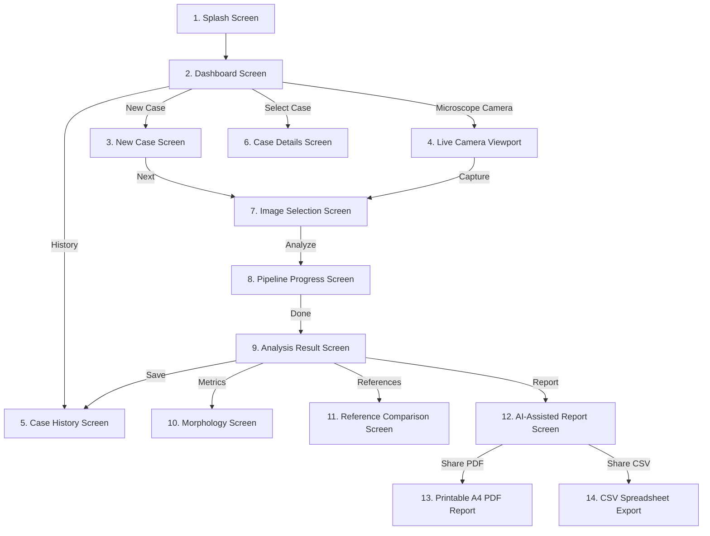

# ColonPath-AI

<div align="center">
  
  <h2>AI-Assisted Colorectal Histopathology Analysis</h2>
  <p><strong>A Modern Android App for Quantitative Tissue Analysis, Reference Matching, and Automated Medical Reporting.</strong></p>

  [-3DDC84?style=for-the-badge&logo=android&logoColor=white)](https://developer.android.com)
  [](https://kotlinlang.org)
  [](https://developer.android.com/jetpack/compose)
  []()
  []()
</div>

---

## 📖 Table of Contents

1. [Overview & Purpose](#-overview--purpose)
2. [Why ColonPath-AI? (Key Strengths)](#-why-colonpath-ai-key-strengths)
3. [Understanding the Basics (Pathology & AI Concepts)](#-understanding-the-basics-pathology--ai-concepts)
4. [Current Features (What is Built)](#-current-features-what-is-built)
5. [How the App Works (User Workflow)](#-how-the-app-works-user-workflow)
6. [App Architecture & Tech Stack](#-app-architecture--tech-stack)
7. [Project Structure](#-project-structure)
8. [Future Roadmap (What Comes Next)](#-future-roadmap-what-comes-next)
9. [How to Run the Project](#-how-to-run-the-project)
10. [Disclaimer](#-disclaimer)

---

## 🔬 Overview & Purpose

**ColonPath-AI** is a native Android application designed to assist doctors and pathologists in examining colorectal tissue biopsies stained with **Hematoxylin & Eosin (H&E)**.

In standard hospital pathology, examining microscope slides manually takes significant time and relies heavily on visual estimation. **ColonPath-AI** introduces a digital, assistive workflow right on an Android phone or tablet:
- **Measures cell structures automatically** (cell density, shape circularity, gland sizes).
- **Finds similar historical reference cases** to help guide the evaluation.
- **Generates instant, formatted A4 PDF medical reports** with one tap.
- **Stores and manages biopsy cases securely offline** on the device.

---

## 🌟 Why ColonPath-AI? (Key Strengths)

- **📱 Mobile-First & Lightweight**: Built 100% natively in Kotlin and Jetpack Compose for smooth, zero-lag performance on mobile devices.
- **🔬 Interactive Multi-Layer Viewer**: Switch easily between raw tissue images, nuclear detection masks, gland boundary outlines, and combined AI overlays.
- **📐 Clear Quantitative Metrics**: Replaces vague guesswork with concrete numbers (e.g., cell count, average gland area, shape irregularity).
- **🔍 Transparent Reference Retrieval**: Instead of giving an unexplained "black-box" prediction, it shows the closest matching reference cases and explains *why* they match.
- **📄 Built-in PDF Report Engine**: Directly creates printable A4 medical reports with clean tables and patient info without needing external cloud converters.
- **💾 Smart Offline Case Storage**: Auto-generates clean, non-colliding Case IDs (`COL-2026-007`) and saves case history directly to device storage so nothing is lost when the app closes.

---

## 🧠 Understanding the Basics (Pathology & AI Concepts)

### 1. What is an H&E Stained Biopsy?
- **Hematoxylin (Blue/Purple)**: Stains cell nuclei containing DNA and RNA.
- **Eosin (Pink/Red)**: Stains the cytoplasm and connective tissue surrounding cells.

### 2. Normal Tissue vs. Abnormal Tissue
- **Normal Colon Tissue**: Regular, neatly spaced glands (crypts) with small, uniform round nuclei resting neatly at the base.
- **Adenoma (Pre-cancerous Polyp)**: Cells become crowded and elongated; glands become irregular and start branching.
- **Adenocarcinoma (Cancer)**: Cells lose their normal organized shape, glands become disordered and back-to-back, and cell nuclei become enlarged and irregular.

### 3. How the Computer Measures Tissue
- **Cell Density**: How many cell nuclei are packed into a square millimeter of tissue. Higher density usually indicates active cell growth.
- **Nuclear Circularity**: How close a cell nucleus is to a perfect circle (a value of $1.0$ is a circle; values below $0.75$ mean the nucleus is irregular or deformed).
- **Gland Boundary Irregularity**: Measures how bumpy or distorted the gland edges are compared to healthy, smooth glands.
- **Similarity Score**: How closely the specimen's visual features match reference images in the database (expressed as a percentage, e.g., $94.2\%$).

---

## ✨ Current Features (What is Built)

### 1. 🚀 Splash & Launch Screen
- Centered circular official **ColonPath-AI** logo with a smooth 360° breathing pulse animation.
- Modern gradient loading bar that smoothly transitions straight into the Dashboard.

### 2. 📊 Interactive Dashboard
- Live dashboard analytics showing **Total Cases**, **Completed**, **Pending Review**, **In Progress**, and **Failed**.
- Quick-action buttons to launch a **New Analysis** or open the **Microscope Camera**.
- Visual preview card showing the most recently analyzed case.

### 3. 📝 Smart Case Creation & Auto-Sequencing
- **Auto-Calculated Case IDs**: Automatically finds the highest existing case number and generates the next one (`COL-2026-007`).
- **Duplicate Prevention**: If a Case ID already exists, the app alerts you immediately in red and prevents saving duplicates.
- **Reusable Patient IDs**: Multiple biopsy cases can belong to the same Patient ID (`PT-2026-0847`).
- **One-Tap Demo Fill**: Allows quickly filling test sample data with a single button tap.

### 4. 📷 Image Picker & Live Microscope Viewport
- Select specimen images from device storage with automatic quality validation.
- Live camera screen with USB/OTG microscope status detection and capture controls.

### 5. ⚡ 9-Stage Pipeline Simulation
- A sleek loading screen showing step-by-step progress:
  1. Image standardization $\to$ 2. Quality check $\to$ 3. Nuclear analysis $\to$ 4. Cell classification $\to$ 5. Gland segmentation $\to$ 6. Morphology analysis $\to$ 7. Reference retrieval $\to$ 8. AI reasoning $\to$ 9. Report generation.
- Dynamic checkmarks, active animated spinners, and live percentage counter ($0\% \to 100\%$).

### 6. 🔬 Multi-Layer Results & Morphology Analysis
- **Layer Toggle Viewer**: Switch seamlessly between *Original H&E*, *Nuclear Mask*, *Gland Contours*, and *Combined AI View*.
- **Quantitative Morphology Panel**: Displays detailed tables for nuclear area, density, circularity, gland count, and architectural spacing.
- **Save Case to History**: One tap permanently saves the analysis to the on-device database.

### 7. 🔍 Reference Case Comparison
- Displays top matching reference cases (e.g., `REF-021` - $94.2\%$ similarity).
- Direct side-by-side comparison table: **Metric | Reference Baseline | Patient Specimen**.
- Expandable *"Why This Result?"* section explaining the visual feature match.

### 8. 📄 Standardized Report & PDF Engine
- Fully aligned report cards with identical width, padding, and clean typography.
- **Download PDF Report**: Generates an A4 PDF medical report on device with tables, diagnostics, and patient info.
- **Download Analysis Table (CSV)**: Export raw measurements to a spreadsheet file with a dedicated pale blue action button.

### 9. 💾 Persistent Local Database & Lifecycle
- Saves all cases to internal disk storage (`colonpath_cases.json`) via asynchronous background threads.
- Mark case status (*Completed, Review Required, In Progress, Failed*).
- Permanent case deletion with confirmation dialogs.

### 10. ↔️ Fluid Navigation & Directional Motion
- Direction-aware page transitions (slides left or right depending on tab order).
- Modern bottom navigation bar with a smooth **64dp × 32dp** animated capsule bubble.

---

## 🗺️ How the App Works (User Workflow)



---

## 🛠️ App Architecture & Tech Stack

```
┌─────────────────────────────────────────────────────────────┐
│                    Jetpack Compose UI                       │
│  (Splash, Dashboard, NewCase, Progress, Result, Report)     │
└──────────────────────────────┬──────────────────────────────┘
                               │
                               ▼
┌─────────────────────────────────────────────────────────────┐
│                   App Navigation Router                     │
│    (Direction-Aware Page Transitions, Custom Bottom Bar)    │
└──────────────────────────────┬──────────────────────────────┘
                               │
                               ▼
┌─────────────────────────────────────────────────────────────┐
│             SampleDataRepository (Data Store)               │
│   (Auto-ID Engine, In-Memory State, Duplicate Validation)   │
└──────────────┬──────────────────────────────┬───────────────┘
               │                              │
               ▼                              ▼
┌──────────────────────────────┐┌─────────────────────────────┐
│    Background File I/O       ││     PdfReportGenerator      │
│    (colonpath_cases.json)    ││  (Android Vector A4 Canvas) │
└──────────────────────────────┘└─────────────────────────────┘
```

- **Kotlin 2.0 & Jetpack Compose**: 100% modern declarative Android UI with Material 3 design tokens.
- **Decoupled Repository Pattern**: The UI observes data models cleanly, making it ready to plug into a real backend API later without changing the UI screens.
- **Native Android Canvas & `PdfDocument`**: Generates clean vector PDF documents directly on the device.
- **Background I/O Executor**: File saving and reading run on background threads to ensure the UI stays fast and responsive.

---

## 📂 Project Structure

```text
ColonPathAI/
├── app/
│   └── src/
│       └── main/
│           ├── AndroidManifest.xml          # App manifest & file permissions
│           ├── java/com/example/colonpath_ai/
│           │   ├── MainActivity.kt          # App entry point & startup
│           │   ├── components/              # Reusable UI widgets
│           │   │   ├── CaseCard.kt          # Case card with delete & status chips
│           │   │   ├── ComparisonTable.kt   # Reference vs patient comparison table
│           │   │   ├── ImageViewer.kt       # Multi-layer H&E overlay viewer
│           │   │   ├── MetricCard.kt        # Morphology metric card
│           │   │   ├── SectionHeader.kt     # Expandable accordion header
│           │   │   └── StatusBadge.kt       # Status pill (Completed, Failed, etc.)
│           │   ├── data/
│           │   │   └── SampleData.kt        # Repository, auto-ID logic, JSON storage
│           │   ├── model/                   # Data classes (Case, Metrics, Report)
│           │   ├── navigation/
│           │   │   └── AppNavigation.kt     # Screen navigation & bottom bar
│           │   ├── screens/                 # Full screen composables
│           │   │   ├── analysis/            # Result, progress & morphology screens
│           │   │   ├── casedetails/         # Case details & status editor
│           │   │   ├── comparison/          # Reference retrieval comparison
│           │   │   ├── dashboard/           # Main stats dashboard
│           │   │   ├── history/             # Case history & search
│           │   │   ├── live/                # Live microscope camera
│           │   │   ├── newcase/             # New case form & image selector
│           │   │   ├── report/              # Full clinical report view
│           │   │   └── splash/              # Animated logo splash screen
│           │   ├── ui/theme/                # Colors, Typography & Shapes
│           │   └── util/
│           │       └── PdfReportGenerator.kt # A4 PDF report generator
│           └── res/                         # Logo drawables & mipmap icons
├── build.gradle.kts                         # Build configuration
└── README.md                                # Project documentation
```

---

## 🔮 Future Roadmap (What Comes Next)

- [ ] **Phase 2: Python / FastAPI AI Backend**: Build a FastAPI web server to run real deep learning models for nuclear and gland segmentation.
- [ ] **Phase 3: Vector Database Search**: Integrate vector search (e.g., FAISS or Qdrant) to match biopsy image embeddings against thousands of reference slides.
- [ ] **Phase 4: Whole Slide Images (WSI)**: Support multi-gigabyte digital pathology slide files (`.svs`, `.ndpi`) with deep zoom.
- [ ] **Phase 5: Medical LLM Integration**: Connect the report generator to a medical language model to automatically summarize diagnostic insights.
- [ ] **Phase 6: Live USB Microscope Video**: Direct USB video driver to stream live 4K microscope feeds.

---

## 🚀 How to Run the Project

1. **Clone the Repository**:
   ```bash
   git clone https://github.com/Adithya-PK/colonPath.git
   cd colonPath
   ```

2. **Build the Debug APK (Windows PowerShell)**:
   ```powershell
   $env:JAVA_HOME = "C:\Program Files\Android\Android Studio\jbr"
   .\gradlew.bat assembleDebug --no-daemon
   ```

3. **Install on Your Phone**:
   ```bash
   adb install -r app/build/outputs/apk/debug/app-debug.apk
   ```

---

## ⚠️ Disclaimer

> **RESEARCH PROTOTYPE NOTICE**:
> ColonPath-AI is currently a technological and research prototype created for demonstration purposes. It is not approved as a medical device for primary diagnostic use. All sample outputs, similarity metrics, and AI summaries must be reviewed and confirmed by a certified medical pathologist.
