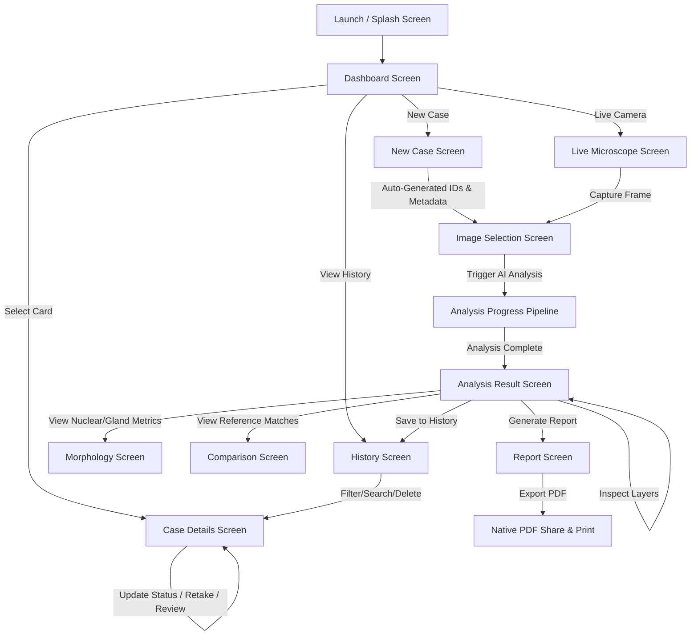

# ColonPath-AI

<div align="center">
  
  <h3>AI-Assisted Colorectal Histopathology Analysis</h3>
  <p><strong>An Intelligent Mobile Platform for Quantitative Morphology, Reference Retrieval, and Automated Diagnostic Reporting in Digital Pathology.</strong></p>

  [-brightgreen.svg)](https://developer.android.com)
  [](https://kotlinlang.org)
  [](https://developer.android.com/jetpack/compose)
  [-success.svg)]()
  []()
</div>

---

## 📖 Table of Contents

1. [Executive Overview](#-executive-overview)
2. [Current Implemented Features](#-current-implemented-features)
3. [App Workflow & User Journey](#-app-workflow--user-journey)
4. [Architecture & Technical Implementation](#-architecture--technical-implementation)
5. [Project Structure](#-project-structure)
6. [Roadmap: What's There to Add](#-roadmap-whats-there-to-add)
7. [Installation & Build Guide](#-installation--build-guide)
8. [Clinical & Research Disclaimer](#-clinical--research-disclaimer)

---

## 🔬 Executive Overview

**ColonPath-AI** is a mobile-first digital pathology assistant designed to streamline the evaluation of Hematoxylin & Eosin (H&E) stained colorectal tissue specimens. The system bridges the gap between laboratory microscopy and computational pathology by offering:

- **Automated Quantitative Morphology**: High-resolution measurement of nuclear pleomorphism, glandular architectural distortion, and spatial cell distribution.
- **Reference-Guided Retrieval**: Comparative similarity analysis against histological reference databases.
- **AI-Assisted Diagnostic Reports**: Instant structured diagnostic summaries, computational findings, and automated A4 PDF export.
- **Offline Clinical Record Storage**: Persistent on-device case tracking, status lifecycles, and pathologist note archiving.

---

## ✨ Current Implemented Features

### 1. 🚀 Launch & Brand Experience
- **Official Branding**: Centered high-resolution ColonPath-AI neural-lattice branding with subtle scaling entrance animations.
- **Interactive Startup Sequence**: Animated medical-grade progress loader transitioning seamlessly into the main dashboard.
- **Native Launcher Icons**: Multi-density mipmap support (`mdpi` through `xxxhdpi`) with adaptive white background.

### 2. 📊 Interactive Dashboard
- **Dynamic Case Analytics**: Real-time calculated counters for **Total Cases**, **Completed**, **Pending Review**, and **Active Pipeline Cases**.
- **Hero Action Center**: Dual interactive pill buttons for `+ New Analysis` and `Camera Live Analysis`.
- **Recent Case Overview**: Visual preview of the latest analyzed specimen with status indicators.
- **Quick-Access Case Cards**: Direct navigation to detailed case analysis reports and specimen metadata.

### 3. 📝 New Case Creation & Sequential ID Auto-Generation
- **Automated Identifier Generation**: Auto-generates unique sequential Case IDs (`COL-2026-006...`) and Patient IDs (`PT-2026-xxxx`).
- **Specimen Metadata Tracking**: Configurable tissue origin (*Colorectal, Ascending Colon, Rectum*), sample type (*Biopsy, Polypectomy, Resection*), and staining protocol (*H&E standard, Special Stain*).
- **Persistent Notes Storage**: Bi-directional patient and specimen notes saved across sessions.

### 4. 📷 Image Acquisition & Live Microscope Interface
- **Specimen Image Selection**: Gallery and file system selection interface with magnification and image quality checks.
- **Live USB Microscope Viewport**: Dedicated camera integration layout with OTG/USB hardware connection status, live frame capture controls, and optical calibration readouts.

### 5. ⚡ Real-Time Pipeline Simulation
- **Multi-Stage Analysis Pipeline**: Rapid, fluid step-by-step progress tracking:
  1. Image Quality Assessment
  2. Nuclear Segmentation & Density Computation
  3. Nuclear Pleomorphism Classification
  4. Gland Boundary Segmentation
  5. Morphology & Spacing Metric Extraction
  6. Reference Case Vector Retrieval
  7. Multi-Evidence AI Reasoning
  8. Diagnostic Report Synthesis

### 6. 🔬 Multi-Layer Visualization & Analysis Results
- **Multi-Layer Image Viewer**: Dynamic layer switching between **Original H&E**, **Nuclear Segmentation**, **Gland Boundaries**, and **Combined AI Overlays**.
- **Diagnostic Confidence Summary**: AI primary assessment with structured confidence metrics and morphological indicators.
- **Save to History Action**: One-tap action to commit the case to permanent storage, update status to `COMPLETED`, and present instant confirmation feedback.

### 7. 📐 Deep Quantitative Morphology Analysis
- **Nuclear Architecture**:
  - Nuclear Count & Density ($\text{nuclei/mm}^2$)
  - Mean Nuclear Area & Perimeter ($\mu\text{m}^2$, $\mu\text{m}$)
  - Nuclear Circularity Index & Pleomorphism Distribution
  - Nuclear-to-Cytoplasmic (N:C) Ratio Estimation
- **Glandular Architecture**:
  - Total Gland Count & Mean Area
  - Glandular Spacing & Spatial Density
  - Branching & Lumen Boundary Irregularity
  - Architectural Crowding & Cribriform Pattern Index

### 8. 🔍 Reference Case Comparison Matrix
- **Similarity Scoring**: Ranked cosine/vector similarity against verified historical case archives.
- **Side-by-Side Morphology Breakdown**: Quantitative comparison table contrasting the active specimen against reference cases for cellular density, nuclear atypicality, and gland architecture.
- **AI Differential Evidence**: Contextual rationale explaining match confidence and histological similarities.

### 9. 📄 Native A4 Medical PDF Report Engine (`PdfReportGenerator.kt`)
- **Direct Canvas Vector Generation**: Generates standard A4 medical reports using Android's native `PdfDocument` engine without external rendering dependencies.
- **Automated Word-Boundary Wrapping**: Robust dynamic layout engine that prevents text clipping across arbitrary screen resolutions.
- **Clinical Layout Architecture**:
  - Medical Header & Patient Demographics Grid
  - Computational Morphology Summary Box
  - Multi-Column Comparison Table
  - AI Differential Diagnosis & Uncertainty Bounds
  - Pathologist Review Sign-off Block & Confidentiality Disclaimer
- **Android FileProvider Sharing**: Instant sharing via WhatsApp, Email, Drive, or native print spoolers.

### 10. 💾 Persistent Local Database & Lifecycle (`SampleDataRepository.kt`)
- **Disk Persistence**: Saves all case records to internal storage (`colonpath_cases.json`).
- **Non-Blocking Background I/O**: Asynchronous file writes via dedicated background executor (`Dispatchers.IO`), eliminating main-thread UI jank.
- **Case Lifecycle Management**: Interactive status chips (*Completed, Review Required, In Progress, Failed*).
- **Permanent Deletion**: In-card trash button with confirmation dialogs; deleted records are permanently removed across restarts.
- **Failed Specimen Recovery**: Dedicated warning cards for failed specimens with **Retake Image** and **Request Second Review** triggers.

### 11. ↔️ Directional Motion & Fluid UI Navigation
- **Direction-Aware Page Transitions**: NavHost automatically detects whether navigation moves forward or backward in tab index, sliding screens seamlessly Left-to-Right or Right-to-Left.
- **High-Performance Bottom Navigation**: Custom zero-latency navigation bar with an animated **64dp × 32dp** selection capsule.

---

## 🗺️ App Workflow & User Journey



---

## 🛠️ Architecture & Technical Implementation

```
┌─────────────────────────────────────────────────────────────┐
│                    Jetpack Compose UI                       │
│  (Screens: Splash, Dashboard, Analysis, Morphology, etc.)   │
└──────────────────────────────┬──────────────────────────────┘
                               │
                               ▼
┌─────────────────────────────────────────────────────────────┐
│                   ColonPath Navigation                      │
│     (Directional Transitions, Custom Smooth Bottom Bar)     │
└──────────────────────────────┬──────────────────────────────┘
                               │
                               ▼
┌─────────────────────────────────────────────────────────────┐
│                  SampleDataRepository                       │
│   (Central Data Store, ID Generator, State Management)      │
└──────────────┬──────────────────────────────┬───────────────┘
               │                              │
               ▼                              ▼
┌──────────────────────────────┐┌─────────────────────────────┐
│    Background I/O Storage    ││   PdfReportGenerator        │
│    (colonpath_cases.json)    ││   (A4 Vector Canvas Engine) │
└──────────────────────────────┘└─────────────────────────────┘
```

- **Architecture Pattern**: Decoupled Repository Pattern (`SampleDataRepository`). The UI layer interacts exclusively through state observables, allowing future backend replacement (FastAPI / SQLite / Room) without touching UI composables.
- **Concurrency**: Asynchronous Kotlin Coroutines and background single-thread executors for file I/O and PDF generation.
- **UI Framework**: 100% Jetpack Compose with Material 3 design tokens and custom medical color palette (`HEPink`, `Blue500`, `Navy800`, `GreenSuccess`, `AmberWarning`).

---

## 📂 Project Structure

```text
ColonPathAI/
├── app/
│   ├── src/
│   │   └── main/
│   │       ├── AndroidManifest.xml          # App manifest & FileProvider configuration
│   │       ├── java/com/example/colonpath_ai/
│   │       │   ├── MainActivity.kt          # Edge-to-edge entry point & data init
│   │       │   ├── components/              # Modular UI components
│   │       │   │   ├── CaseCard.kt          # Full-width case card with embedded actions
│   │       │   │   ├── ComparisonTable.kt   # Reference metrics data table
│   │       │   │   ├── EmptyState.kt        # Search/filter empty state placeholder
│   │       │   │   ├── ErrorState.kt        # Pipeline error recovery view
│   │       │   │   ├── ImageViewer.kt       # Multi-layer H&E segmentation viewer
│   │       │   │   ├── MetricCard.kt        # Quantitative morphology metric card
│   │       │   │   ├── PipelineStep.kt      # Progress step indicator
│   │       │   │   ├── SectionHeader.kt     # Accordion header with animated arrow
│   │       │   │   └── StatusBadge.kt       # Clinical case status chip
│   │       │   ├── data/
│   │       │   │   └── SampleData.kt        # Repository, JSON persistence, Mock data
│   │       │   ├── model/                   # Domain models
│   │       │   │   ├── AIReport.kt          # Diagnostic report data structure
│   │       │   │   ├── AnalysisResult.kt    # Full analysis container
│   │       │   │   ├── Case.kt              # Specimen & patient case model
│   │       │   │   ├── GlandAnalysis.kt     # Glandular morphology attributes
│   │       │   │   ├── MorphologyMetrics.kt # Combined quantitative metrics
│   │       │   │   ├── NuclearAnalysis.kt   # Nuclear pleomorphism metrics
│   │       │   │   └── ReferenceResult.kt   # Comparative reference case model
│   │       │   ├── navigation/
│   │       │   │   └── AppNavigation.kt     # Directional NavHost & animated Bottom Bar
│   │       │   ├── screens/
│   │       │   │   ├── analysis/            # Analysis results & morphology screens
│   │       │   │   ├── casedetails/         # Case detail view & status management
│   │       │   │   ├── comparison/          # Reference retrieval comparison view
│   │       │   │   ├── dashboard/           # Main stats & navigation dashboard
│   │       │   │   ├── history/             # Case history search, filter, and delete
│   │       │   │   ├── live/                # Live USB microscope camera view
│   │       │   │   ├── newcase/             # New case metadata & image picker
│   │       │   │   ├── report/              # Full clinical report preview
│   │       │   │   └── splash/              # Animated brand launch screen
│   │       │   ├── ui/theme/                # Typography, Shapes, Colors, Theme
│   │       │   └── util/
│   │       │       └── PdfReportGenerator.kt # A4 PDF vector canvas generator
│   │       └── res/
│   │           ├── drawable/                # Logo assets & adaptive vectors
│   │           ├── mipmap-*/                # Multi-density app launcher icons
│   │           └── xml/                     # FileProvider & backup rules
├── build.gradle.kts                         # Project build configuration
├── settings.gradle.kts                      # Dependency resolution
└── README.md                                # Project documentation
```

---

## 🔮 Roadmap: What's There to Add

### Phase 2: Python / FastAPI AI Backend Integration
- [ ] **REST / WebSocket Client**: Replace mock repository calls with Retrofit/Ktor HTTP clients connecting to a remote FastAPI server.
- [ ] **Deep Learning Inference Pipeline**:
  - **Nuclear Segmentation**: Hover-Net / Cellpose / StarDist models.
  - **Gland Boundary Extraction**: SegFormer / UNet for epithelial and lumen segmentation.
  - **Histopathology Foundation Embeddings**: Image feature extraction using UNI / CONCH / Prov-GigaPath vision models.

### Phase 3: Vector Retrieval & Whole Slide Image (WSI) Support
- [ ] **Vector Database Search**: Integration with FAISS / Qdrant / Milvus for sub-second similarity retrieval across millions of reference cases.
- [ ] **WSI Pyramid Viewer**: Support for multi-gigabyte SVS / NDPI / TIFF digital pathology whole slide images with deep-zoom tiling.
- [ ] **Region of Interest (ROI) Cropping**: Touch-guided bounding box selection directly on the whole slide viewer.

### Phase 4: Clinical Agentic Reasoning & LLM Integration
- [ ] **Medical Multimodal LLM**: Connect analysis stage to clinical LLMs (e.g., Med-PaLM / Gemini Pro Medical) for automated narrative report drafting.
- [ ] **Differential Diagnosis Ranking**: Ranked differential diagnostic hypotheses with explicit confidence scores and uncertainty boundaries.
- [ ] **Pathologist Voice Dictation**: Voice-to-text integration for rapid case dictation and note transcription.

### Phase 5: Hardware & Microscope Integration
- [ ] **Direct USB UVC Driver**: Native Android USB Host driver to stream uncompressed 4K video directly from laboratory USB microscope cameras.
- [ ] **Real-Time Focus & White Balance Assist**: Edge-detection assisted focus peaking and automated color normalization (Macenko / Vahadane staining normalization).

### Phase 6: Hospital Enterprise & Cloud Sync
- [ ] **DICOM Part 10 Compliance**: Read and write standard DICOM Whole Slide Imaging formats.
- [ ] **HL7 / FHIR Integration**: Direct synchronization with Hospital Information Systems (HIS) and Laboratory Information Management Systems (LIMS).
- [ ] **Multi-User Role-Based Access Control**: Separate permissions for Lab Technicians, Pathologists, and Chief Medical Officers.

---

## 🚀 Installation & Build Guide

### Prerequisites
- **Android Studio**: Ladybug (2024.2+) or newer.
- **JDK**: Java 17 or Java 21 (`$env:JAVA_HOME = "C:\Program Files\Android\Android Studio\jbr"`).
- **Android Device / Emulator**: Android 8.0 (API Level 26) or higher.

### Building from Source

1. **Clone the Repository**:
   ```bash
   git clone https://github.com/Adithya-PK/colonPath.git
   cd colonPath
   ```

2. **Assemble Debug APK**:
   ```bash
   # On Windows PowerShell
   $env:JAVA_HOME = "C:\Program Files\Android\Android Studio\jbr"
   .\gradlew.bat assembleDebug --no-daemon
   ```

3. **Install on Connected Device**:
   ```bash
   adb install -r app/build/outputs/apk/debug/app-debug.apk
   ```

---

## ⚠️ Clinical & Research Disclaimer

> **IMPORTANT**: ColonPath-AI is currently a **research and technological prototype**. It is designed to demonstrate human-AI collaborative workflows in digital pathology. It is **not** certified as a medical device for primary diagnostic use. All computational metrics, segmentation masks, and AI summaries are for investigative purposes and must be verified by a licensed pathologist.
