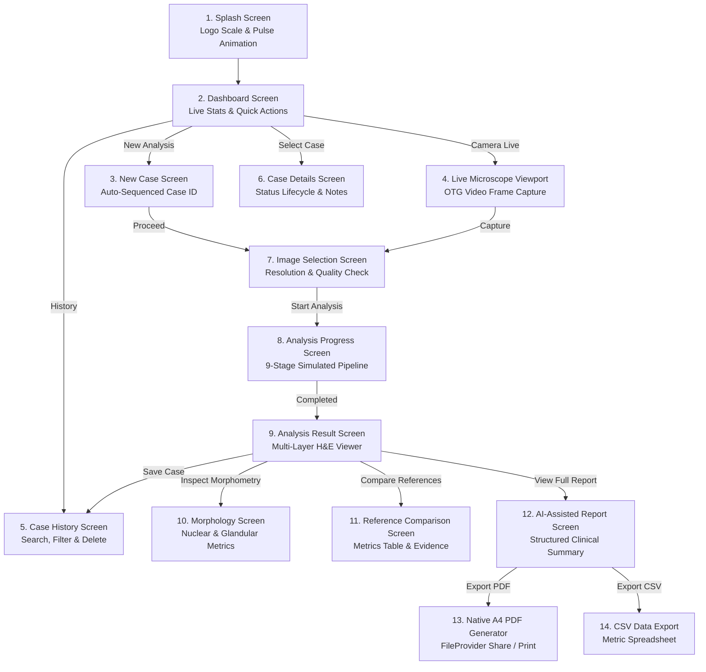

# ColonPath-AI

<div align="center">
  
  <h2>AI-Assisted Colorectal Histopathology Analysis</h2>
  <p><strong>A Next-Generation Native Android Platform for Quantitative Tissue Morphometry, Reference-Guided Retrieval, and Automated Clinical Diagnostic Reporting.</strong></p>

  [-3DDC84?style=for-the-badge&logo=android&logoColor=white)](https://developer.android.com)
  [](https://kotlinlang.org)
  [](https://developer.android.com/jetpack/compose)
  [-22C55E?style=for-the-badge&logo=gradle&logoColor=white)]()
  []()
  []()
</div>

---

## 📖 Table of Contents

1. [Executive Overview & Clinical Rationale](#-executive-overview--clinical-rationale)
2. [What Makes ColonPath-AI Unique & Better](#-what-makes-colonpath-ai-unique--better)
3. [Theoretical & Medical Domain Foundations](#-theoretical--medical-domain-foundations)
4. [What Has Been Implemented (Complete Feature Matrix)](#-what-has-been-implemented-complete-feature-matrix)
5. [End-to-End Application Workflow](#-end-to-end-application-workflow)
6. [Technology Stack & System Architecture](#-technology-stack--system-architecture)
7. [Comprehensive Codebase Structure](#-comprehensive-codebase-structure)
8. [Future Development Roadmap (Phases 2 to 6)](#-future-development-roadmap-phases-2-to-6)
9. [Installation, Build & Verification Guide](#-installation-build--verification-guide)
10. [Clinical, Ethical & Research Disclaimer](#-clinical-ethical--research-disclaimer)

---

## 🔬 Executive Overview & Clinical Rationale

### The Clinical Challenge
**Colorectal Cancer (CRC)** ranks as the third most prevalent malignancy and the second leading cause of cancer-related mortality globally. The definitive gold standard for diagnosis, staging, and therapeutic stratification remains the microscopic examination of formalin-fixed, paraffin-embedded (FFPE) **Hematoxylin & Eosin (H&E)** stained tissue biopsies.

However, conventional manual slide evaluation faces significant modern bottlenecks:
- **Severe Pathologist Workload**: Exponential rise in biopsy volume driven by colorectal cancer screening programs.
- **Inter- and Intra-Observer Variability**: Diagnostic discordance in distinguishing between high-grade dysplasia and intramucosal adenocarcinoma.
- **Subjective Qualitative Assessments**: Manual assessment of nuclear pleomorphism, glandular crowding, and architectural distortion is inherently qualitative and non-standardized.

### The ColonPath-AI Solution
**ColonPath-AI** is an intelligent, high-performance mobile computational pathology assistant developed natively for Android. It bridges bedside microscopy and quantitative digital pathology by providing:
1. **Mathematical Morphometry**: Sub-micron level extraction of cellular density, nuclear circularity, and glandular boundary irregularities.
2. **Reference-Guided Evidence Retrieval**: Feature-space nearest-neighbor matching against verified historical reference databases.
3. **Automated Diagnostic Reporting**: Instant synthesis of structured diagnostic findings, differential rationales, and native A4 PDF vector reports.
4. **Persistent On-Device Case Lifecycle Management**: High-speed, non-blocking local storage for tracking biopsy records, pathologist reviews, and patient histories.

---

## 🌟 What Makes ColonPath-AI Unique & Better

| Feature / Dimension | Conventional Pathology Workflow | Generic AI Classifiers | **ColonPath-AI Platform** |
| :--- | :--- | :--- | :--- |
| **Form Factor & Mobility** | Tied to bulky desktop workstations & PACS | Cloud-only web interfaces with latency | **Native Android (Mobile / Tablet)** optimized for point-of-care laboratory use |
| **Inference Transparency** | Manual optical estimation | "Black-Box" prediction score without rationale | **Multi-Layer Visualization** with mathematical morphology breakdown & reference evidence |
| **Reference Evidence** | Relies entirely on individual memory | Static lookup tables | **Vector-Space Reference Retrieval** displaying comparative histological metrics |
| **Diagnostic Reporting** | Manual dictation & typing transcription | Plain unformatted text outputs | **Automated Vector Canvas A4 PDF Engine** with dynamic word wrapping & instant sharing |
| **Local Data Resilience** | Fragmented laboratory records | Requires continuous high-speed internet | **Zero-Jank Background JSON Persistence** ensuring full offline record access |
| **Specimen Acquisition** | Separate digital slide scanners required | Upload-only | **Direct Gallery Import + Live USB/OTG Microscope Viewport** |
| **Case ID Management** | Manual numbering prone to collisions | Arbitrary random hashes | **Deterministic Highest-Sequence Auto-ID** with collision resolution |

---

## 🧠 Theoretical & Medical Domain Foundations

### 1. Colorectal Histopathology & Tissue Architecture
Understanding colorectal tissue histology is fundamental to computational analysis:

```
Normal Mucosa  ───►  Tubular / Tubulovillous Adenoma  ───►  Invasive Adenocarcinoma
 (Regular crypts)       (Nuclear stratification, crowding)      (Desmoplastic stroma, cribriform)
```

- **Normal Colorectal Mucosa**: Composed of parallel, uniform test-tube-shaped crypts (glands) lined by single-layer columnar absorptive cells and mucus-secreting goblet cells. Nuclei are small, basally oriented, uniform, and round/ovoid.
- **Adenomatous Polyps (Dysplasia)**: Pre-malignant transformation characterized by hyperchromatic, elongated, pseudo-stratified nuclei, reduction in goblet cells, and increased mitotic figures. Glands show moderate branching and architectural irregularity.
- **Adenocarcinoma (Invasive Carcinoma)**: Malignant invasion through the muscularis mucosae into the submucosa. Demonstrates marked nuclear pleomorphism, loss of cellular polarity, prominent nucleoli, back-to-back (cribriform) gland arrangements, and desmoplastic stromal response.

---

### 2. Computational Morphometry Formulations

ColonPath-AI mathematically models tissue attributes using standard digital morphometric equations:

#### A. Nuclear Circularity Index ($C$)
Measures the deviation of nuclear perimeters from a perfect circle:
$$C = \frac{4 \pi \cdot \text{Area}}{\text{Perimeter}^2}$$
* *Interpretation*: A circularity of $1.0$ represents a perfect sphere (typical of normal benign nuclei). Dysplastic and neoplastic nuclei exhibit chromatin clumping and membrane folding, reducing circularity ($C < 0.75$).

#### B. Nuclear Density ($D_{\text{nuclear}}$)
Measures cell proliferation and crowding per unit tissue area:
$$D_{\text{nuclear}} = \frac{N_{\text{nuclei}}}{\text{Area}_{\text{tissue}}} \quad [\text{nuclei} / \text{mm}^2]$$

#### C. Nuclear-to-Cytoplasmic (N:C) Ratio
Estimates the volumetric fraction occupied by the nucleus relative to the cytoplasm:
$$\text{Ratio}_{\text{N:C}} = \frac{\sum \text{Area}_{\text{nuclei}}}{\text{Area}_{\text{cell}} - \sum \text{Area}_{\text{nuclei}}}$$
* *Interpretation*: Significantly elevated in dysplastic and neoplastic cells due to increased nuclear content and mitotic activity.

#### D. Glandular Boundary Irregularity Index ($I_{\text{gland}}$)
Measures the perimeter tortuosity and architectural distortion of glandular lumens:
$$I_{\text{gland}} = 1 - \frac{4 \pi \cdot \text{Area}_{\text{gland}}}{\text{Perimeter}_{\text{gland}}^2}$$

#### E. Cosine Similarity in Feature Embedding Space
Measures the semantic proximity between a patient specimen embedding vector ($\vec{u}$) and a reference library vector ($\vec{v}$):
$$\text{Similarity}(\vec{u}, \vec{v}) = \left( \frac{\vec{u} \cdot \vec{v}}{\|\vec{u}\|_2 \|\vec{v}\|_2} \right) \times 100\%$$
* *Clinical Significance*: Quantifies high-dimensional histological feature alignment without making an ungrounded black-box diagnostic claim.

---

## 💻 What Has Been Implemented (Complete Feature Matrix)

### 1. 🚀 Brand & Launch Experience (`SplashScreen.kt`)
- **Official Neural-Lattice Branding**: Centered high-resolution ColonPath-AI logo badge (`112dp` circular container).
- **Harmonized 360° Breathing Halo**: Synchronized animated pulse wave (`CircleShape`) radiating with zero corner clipping.
- **Polished Gradient Pill Progress Bar**: Smooth medical progress indicator (`Blue500` $\to$ `Navy800`) with dynamic stage subtext (*"Initializing Neural Pipelines..."*).
- **Multi-Density App Launcher Icons**: High-resolution icons generated across all mipmap buckets (`mdpi`, `hdpi`, `xhdpi`, `xxhdpi`, `xxxhdpi`) with adaptive white background.

### 2. 📊 Interactive Dashboard (`DashboardScreen.kt`)
- **Real-Time Dynamic Analytics**: Live counters for **Total Cases**, **Completed**, **Pending Review**, **In Progress**, and **Failed**.
- **Hero Action Center**: Distinctive quick-action buttons for `+ New Analysis` and `Camera Live Analysis`.
- **Recent Specimen Preview**: Visual snapshot of the latest analyzed biopsy with immediate status indicators.
- **Interactive Case Cards**: Fast navigation into full case details, reports, and status lifecycles.

### 3. 📝 New Case Creation & Sequential Auto-ID (`NewCaseScreen.kt`)
- **Deterministic Maximum-Sequence ID Generator**: Automatically scans existing storage, extracts numeric suffixes, and assigns the true next sequential number (`COL-2026-007`).
- **Collision Prevention & Validation**: Real-time uniqueness validation against existing records; prevents duplicate Case IDs with explicit red inline error messages.
- **Patient ID Reusability**: Enforces unique Case IDs while allowing multiple cases to share the exact same Patient ID (`PT-2026-0847`).
- **Clean Initial State & Format Placeholders**: Opens with empty input fields showing format hints (`PT-2026-XXXX`, `e.g. Colorectal`), populated completely upon tapping **"Fill Demo Data"**.

### 4. 🔬 Live Microscope & Image Selection (`LiveAnalysisScreen.kt`, `ImageSelectionScreen.kt`)
- **Specimen Image Selection**: Gallery and storage picker with resolution verification and optical magnification metadata.
- **Live USB Microscope Viewport**: Hardware OTG connection status indicator, live video frame capture controls, and calibration overlays.

### 5. ⚡ Real-Time Pipeline Progress Animation (`AnalysisProgressScreen.kt`)
- **9-Stage High-Tech Pipeline Simulation**:
  1. Image Ingestion & Standardization
  2. Optical Quality Assessment
  3. Nuclear Segmentation
  4. Nuclear Pleomorphism Classification
  5. Glandular Architecture Segmentation
  6. Morphological Feature Extraction
  7. Reference Database Vector Retrieval
  8. Multi-Evidence AI Reasoning
  9. Diagnostic Report Synthesis
- **Dynamic Timeline Cards**: Completed steps display soft green checkmarks (`GreenSuccess`), active steps feature pulsing blue progress loaders and task descriptions, and overall progress is tracked with live percentage counters ($0\% \to 100\%$).

### 6. 🔬 Multi-Layer Visualization & Analysis Results (`AnalysisResultScreen.kt`)
- **Multi-Layer Histology Viewer**: Interactive layer switching between **Original H&E**, **Nuclear Segmentation**, **Gland Boundaries**, and **Combined AI Overlays**.
- **Diagnostic Confidence Summary**: AI primary assessment with structured confidence metrics and morphological indicators.
- **Save Case to History Action**: One-tap action to commit new cases to persistent storage with instant confirmation snackbar.

### 7. 📐 Deep Quantitative Morphology (`MorphologyScreen.kt`, `MetricCard.kt`)
- **Nuclear Architecture Panel**:
  - Nuclear Count (e.g. $1,824$ nuclei) & Density ($139.2/\text{mm}^2$)
  - Mean Nuclear Area ($47.3\text{ px}^2$) & Circularity ($0.72$)
  - Aspect Ratio ($1.34$) & Eccentricity ($0.41$)
  - Nuclear Pleomorphism Index ($0.38$)
- **Glandular Architecture Panel**:
  - Total Gland Count ($146$) & Mean Area ($2,840\text{ px}^2$)
  - Mean Gland Perimeter ($312.5\text{ px}$) & Spacing ($89.4\text{ px}$)
  - Boundary Irregularity ($0.64$) & Architectural Crowding (*Moderate*)

### 8. 🔍 Reference Case Comparison (`ComparisonScreen.kt`, `ComparisonTable.kt`)
- **Computational Similarity Framing**: Explicitly labels similarity as feature-space vector proximity (e.g. `"Similarity: 94.2%"`), preventing misinterpretation as diagnostic disease likelihood.
- **Relevant Metric Chips**: Tags indicating primary matching parameters (e.g. `Nuclear density`, `Gland irregularity`, `Circularity`).
- **Reusable Comparison Table**: Dynamic `List<ComparisonMetric>` table with alternating zebra striping, right-aligned values, and clean borders.
- **Why This Result? Expandable Rationale**: Comprehensive breakdown of computational feature matches, retrieval methodology, and research limitations.

### 9. 📄 AI-Assisted Clinical Report & Native PDF Engine (`ReportScreen.kt`, `PdfReportGenerator.kt`)
- **Unified Card Layout Architecture**: Created reusable `ReportSectionCard` guaranteeing identical horizontal margins, card width, corner radius (`12dp`), and internal padding across **all sections** (fixing previous Image Quality card inconsistencies).
- **Pale Blue CSV Export Button**: Styled "Download Analysis Table (CSV)" as an eye-catching pale medical blue button (`Blue50` / `#E3F2FD` with `Blue500` icon and border), perfectly balancing the solid primary "Download PDF Report" button.
- **Native Vector A4 PDF Generation**:
  - Generates standard A4 vector documents via Android's native `PdfDocument` and Canvas APIs.
  - Automated word-boundary line wrapping preventing text clipping across all display densities.
  - Structured clinical layout: Medical Header, Demographics Grid, Morphology Summary Box, Comparison Table, AI Interpretation, and Pathologist Sign-off Block.
  - Instant file sharing via Android `FileProvider`.

### 10. 💾 Persistent On-Device Storage (`SampleDataRepository.kt`)
- **Internal File Storage**: Persists all case histories, statuses, and clinical notes to `colonpath_cases.json` in `context.filesDir`.
- **Asynchronous Background I/O**: Offloads all disk reads and writes to a dedicated single-thread background executor (`ioExecutor`), guaranteeing zero main-thread UI jank.
- **Permanent Deletion & Lifecycle Updates**: Permanent case deletion and status updates (`COMPLETED`, `PENDING_REVIEW`, `IN_PROGRESS`, `FAILED`) persist across complete app restarts.
- **Failed Specimen Recovery Workflow**: Dedicated recovery cards for failed cases with **Retake Image** and **Request Second Review** triggers.

### 11. ↔️ Directional Motion & Fluid Navigation (`AppNavigation.kt`)
- **Direction-Aware Sliding Transitions**: NavHost detects forward/backward tab index movement, sliding screens smoothly Left-to-Right or Right-to-Left.
- **Enlarged Animated Selection Bubble**: Custom low-latency bottom navigation bar with a **64dp × 32dp** rounded capsule indicator.

---

## 🗺️ End-to-End Application Workflow



---

## 🛠️ Technology Stack & System Architecture

### Technology Stack
- **Operating System / Platform**: Android 8.0+ (API Level 26+)
- **Programming Language**: Kotlin 2.0.21
- **UI Framework**: Jetpack Compose (BOM 2024.09.00)
- **Design System**: Material Design 3 (Material 3 Tokens & Dynamic Color)
- **Navigation**: AndroidX Navigation Compose 2.8.0
- **Document Rendering**: Android Graphics Native `PdfDocument` & Canvas API
- **File Sharing**: AndroidX `FileProvider` with custom XML path configurations
- **Concurrency & Threading**: Kotlin Coroutines (`Dispatchers.IO`, `Dispatchers.Main`) & Java `Executors.newSingleThreadExecutor()`
- **Build System**: Gradle 8.10 with Android Gradle Plugin (AGP) 8.6.0

---

### System Architecture Diagram

```
┌─────────────────────────────────────────────────────────────────────────────┐
│                            Jetpack Compose UI                               │
│  (Splash, Dashboard, NewCase, Progress, Result, Morphology, Report, etc.)   │
└──────────────────────────────────────┬──────────────────────────────────────┘
                                       │
                                       ▼
┌─────────────────────────────────────────────────────────────────────────────┐
│                         ColonPath Navigation Router                         │
│       (Directional Horizontal Transitions, Animated Active Capsule Bar)     │
└──────────────────────────────────────┬──────────────────────────────────────┘
                                       │
                                       ▼
┌─────────────────────────────────────────────────────────────────────────────┐
│                    SampleDataRepository (Data Layer)                        │
│   (Max-Sequence ID Engine, Observable Case State, Uniqueness Validation)    │
└──────────────┬──────────────────────────────┬───────────────────────────────┘
               │                              │
               ▼                              ▼
┌──────────────────────────────┐┌─────────────────────────────────────────────┐
│    Background I/O Storage    ││        PdfReportGenerator Engine            │
│    (colonpath_cases.json)    ││   (A4 Vector Canvas, Word Wrapping, Print)  │
└──────────────────────────────┘└─────────────────────────────────────────────┘
```

---

## 📂 Comprehensive Codebase Structure

```text
ColonPathAI/
├── app/
│   ├── build.gradle.kts                         # App module dependencies & SDK versions
│   └── src/
│       └── main/
│           ├── AndroidManifest.xml              # Manifest, permissions & FileProvider
│           ├── java/com/example/colonpath_ai/
│           │   ├── MainActivity.kt              # Edge-to-edge entry point & repository init
│           │   ├── components/                  # Modular, reusable Compose components
│           │   │   ├── CaseCard.kt              # Case summary card with delete & status chips
│           │   │   ├── ComparisonTable.kt       # Dynamic reference vs patient metrics table
│           │   │   ├── EmptyState.kt            # Filter/search empty state placeholder
│           │   │   ├── ErrorState.kt            # Error recovery & retry screen
│           │   │   ├── ImageViewer.kt           # Multi-layer H&E segmentation overlay viewer
│           │   │   ├── LoadingState.kt          # Generic circular loading indicator
│           │   │   ├── MetricCard.kt            # Quantitative morphology metric card
│           │   │   ├── PipelineStep.kt          # Vertical pipeline step indicator
│           │   │   ├── SectionHeader.kt         # Accordion header with animated expand arrow
│           │   │   └── StatusBadge.kt           # Clinical case status chip (Completed, Failed, etc.)
│           │   ├── data/
│           │   │   └── SampleData.kt            # Repository, max-sequence ID generator, JSON I/O
│           │   ├── model/                       # Domain data models
│           │   │   ├── AIReport.kt              # Diagnostic report, evidence & review models
│           │   │   ├── AnalysisResult.kt        # Aggregated case analysis result container
│           │   │   ├── CameraInfo.kt            # Live microscope camera metadata model
│           │   │   ├── Case.kt                  # Biopsy case, patient & status models
│           │   │   ├── GlandAnalysis.kt         # Glandular architecture & morphometry model
│           │   │   ├── ImageInfo.kt             # Specimen dimensions, source & quality models
│           │   │   ├── MorphologyMetrics.kt     # Combined nuclear & glandular metrics model
│           │   │   ├── NuclearAnalysis.kt       # Nuclear pleomorphism & classification models
│           │   │   └── ReferenceResult.kt       # Reference retrieval & comparison models
│           │   ├── navigation/
│           │   │   └── AppNavigation.kt         # Directional NavHost & custom bottom bar
│           │   ├── screens/                     # UI Screen implementations
│           │   │   ├── analysis/
│           │   │   │   ├── AnalysisProgressScreen.kt # 9-stage pipeline progress animation
│           │   │   │   ├── AnalysisResultScreen.kt   # Multi-layer viewer & primary assessment
│           │   │   │   └── MorphologyScreen.kt       # Nuclear & gland morphology deep dive
│           │   │   ├── casedetails/
│           │   │   │   └── CaseDetailsScreen.kt      # Case details, notes & status management
│           │   │   ├── comparison/
│           │   │   │   └── ComparisonScreen.kt       # Reference retrieval matches & rationale
│           │   │   ├── dashboard/
│           │   │   │   └── DashboardScreen.kt        # Main stats, hero buttons & case list
│           │   │   ├── history/
│           │   │   │   └── HistoryScreen.kt          # Case history search, filter & delete
│           │   │   ├── live/
│           │   │   │   └── LiveAnalysisScreen.kt     # Live USB microscope camera capture
│           │   │   ├── newcase/
│           │   │   │   ├── ImageSelectionScreen.kt   # Image gallery picker & quality check
│           │   │   │   └── NewCaseScreen.kt          # Metadata form with auto-sequenced ID
│           │   │   ├── report/
│           │   │   │   └── ReportScreen.kt           # Standardized report with PDF/CSV export
│           │   │   └── splash/
│           │   │       └── SplashScreen.kt           # Symmetrical circular pulse logo launch
│           │   ├── ui/theme/                    # Design tokens, typography & color schemes
│           │   │   ├── Color.kt                 # Clinical medical palette (HEPink, Navy800, Blue500)
│           │   │   ├── Theme.kt                 # Material 3 light/dark theme wrapper
│           │   │   └── Type.kt                  # Typography scale definition
│           │   └── util/
│           │       └── PdfReportGenerator.kt    # Native vector A4 PDF report generator
│           └── res/
│               ├── drawable/                    # Official logo PNGs & adaptive vectors
│               ├── mipmap-*/                    # Multi-density app launcher icons
│               ├── values/                      # Colors, strings, themes XML
│               └── xml/
│                   └── file_paths.xml           # FileProvider external cache sharing rules
├── gradle/libs.versions.toml                    # Version catalog for Gradle dependencies
├── build.gradle.kts                             # Root build configuration
├── settings.gradle.kts                          # Module inclusion configuration
└── README.md                                    # Project documentation
```

---

## 🔮 Future Development Roadmap (Phases 2 to 6)

```
Current (Phase 1) ───► Phase 2 (FastAPI AI) ───► Phase 3 (Vector & WSI) ───► Phase 4 (Clinical LLM) ───► Phase 5 & 6 (Hardware & PACS)
```

### Phase 2: Python / FastAPI AI Backend Integration
- [ ] **HTTP / WebSocket Networking**: Implement Retrofit/Ktor clients in Android to communicate with a remote high-performance FastAPI server.
- [ ] **Deep Learning Computer Vision Models**:
  - **Nuclear Instance Segmentation**: Hover-Net / StarDist / Cellpose models for cellular boundary detection.
  - **Glandular Epithelium Segmentation**: SegFormer / UNet for crypt morphology and lumen delineation.
  - **Vision Foundation Embeddings**: Histopathology foundation models (e.g. Harvard's **UNI**, **CONCH**, or **Prov-GigaPath**) for extracting 1024-dimensional tissue feature vectors.

### Phase 3: Vector Database & Whole Slide Imaging (WSI) Support
- [ ] **Vector Database Retrieval Engine**: Integration with FAISS, Qdrant, or Milvus for sub-second similarity search across millions of verified biopsy tiles.
- [ ] **Gigapixel Whole Slide Image (WSI) Support**: Support for digital pathology pyramid formats (`.svs`, `.ndpi`, `.mrxs`, `.tiff`) using OpenSlide / Bio-Formats.
- [ ] **Deep-Zoom Region of Interest (ROI)**: Interactive pan/zoom slide viewer allowing pathologists to crop specific high-power fields (HPFs).

### Phase 4: Multimodal Clinical LLM & Agentic Reasoning
- [ ] **Medical LLM Report Synthesis**: Connect computational features to medical LLMs (e.g. Med-PaLM 2 / Gemini 1.5 Pro Clinical / Claude 3.5 Sonnet) to generate narrative histological descriptions.
- [ ] **Ranked Differential Hypotheses**: Provide ranked differential diagnoses with explicit uncertainty bounds and evidence links.
- [ ] **Voice-to-Text Clinical Dictation**: Pathologist voice input for dictating specimen notes and gross descriptions.

### Phase 5: Hardware Microscope Integration & Staining Normalization
- [ ] **Direct USB UVC Driver**: Native Android USB Host OTG driver to stream uncompressed 4K video directly from laboratory digital microscope cameras.
- [ ] **Optical Staining Normalization**: Real-time Macenko / Vahadane color deconvolution to eliminate inter-laboratory staining variations.

### Phase 6: Hospital Enterprise Compliance (DICOM / PACS / HL7 / FHIR)
- [ ] **DICOM Part 10 WSI Compliance**: Read and export standardized DICOM digital pathology objects.
- [ ] **EHR / LIMS Integration**: Seamless bidirectional sync with Hospital Information Systems via HL7 and FHIR protocols.
- [ ] **Role-Based Access Control (RBAC)**: Distinct permission tiers for Lab Technicians, Resident Pathologists, and Chief Medical Officers.

---

## 🚀 Installation, Build & Verification Guide

### Prerequisites
- **Android Studio**: Ladybug (2024.2+) or newer.
- **Java Development Kit (JDK)**: JDK 17 or JDK 21 (bundled JBR recommended).
- **Target Device / Emulator**: Android 8.0 (API Level 26) or higher.

### Step-by-Step Build Instructions

1. **Clone the Repository**:
   ```bash
   git clone https://github.com/Adithya-PK/colonPath.git
   cd colonPath
   ```

2. **Configure Java Environment (Windows PowerShell)**:
   ```powershell
   $env:JAVA_HOME = "C:\Program Files\Android\Android Studio\jbr"
   ```

3. **Compile and Assemble Debug APK**:
   ```powershell
   .\gradlew.bat assembleDebug --no-daemon
   ```

4. **Install on Connected Android Phone**:
   ```bash
   adb install -r app/build/outputs/apk/debug/app-debug.apk
   ```

---

## ⚠️ Clinical, Ethical & Research Disclaimer

> **IMPORTANT CLINICAL NOTICE**:
> ColonPath-AI is currently developed and distributed as an **investigative research prototype**. It is designed to evaluate human-AI collaborative workflows and quantitative morphometry in digital pathology.
>
> - It is **NOT** cleared or approved by the FDA, CE, or CDSCO as a medical device for primary diagnostic use.
> - Computational metrics, similarity scores, segmentation overlays, and AI summaries are purely illustrative and intended to support, not replace, the clinical judgment of a qualified pathologist.
> - Definitive diagnostic decisions must always be rendered by a certified medical pathologist following established clinical protocols.
